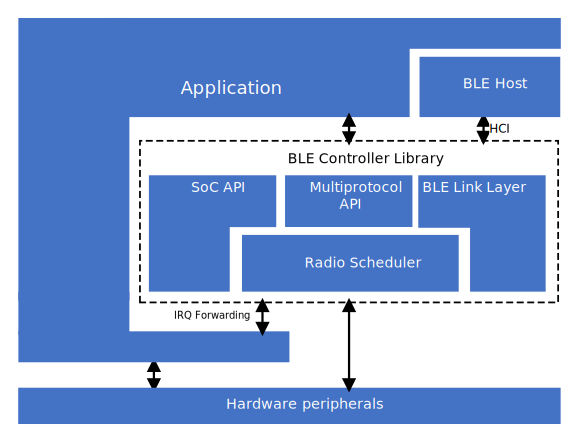
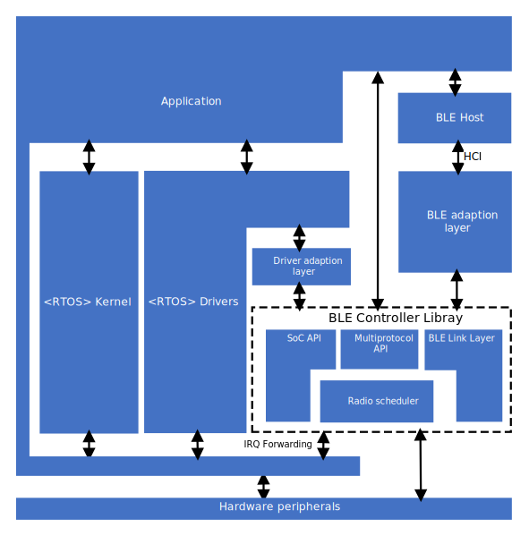

.. _ble_controller_readme:

Integration with applications
#############################

The |controller| is an RTOS-agnostic library built for the Nordic Semiconductor nRF52 and nRF53 Series that supports Bluetooth 5.

For the nRF53 Series, the requirements described in this document are only relevant for applications running alongside the |controller| on the network processor.

Applications utilizing the |controller| library are responsible for the following:

* Forwarding RNG interrupts to the |controller| library.
   The application should not add additional processing in the corresponding interrupt handler.
   Otherwise, the behavior is undefined.
* The |controller| relies on the functionality provided by the Nordic :ref:`mpsl` (Multiprotocol Service Layer), which has its own set of requirements that the application must follow.
* Ensuring thread-safe operation.
   This can be achieved by either:

   * Calling all |controller| and MPSL APIs from the same execution priority,
   * ensuring that no API call is interrupted by other API calls, for example by using critical sections.

* Configuring the number of available links:

   * Link configuration must be done before enabling the controller.
   * The application is required to provide a memory buffer the size of which is dependent on the link configuration.

The following peripherals are owned by the |controller| and must not be accessed directly by the application:

* RNG
* ECB
* AAR
* NVMC
* PPI channels 17 - 31, for the nRF52 Series
* DPPI channels 0 - 13, for the nRF53 Series

The APIs provided in :file:`ble_controller_soc.h` and in MPSL provide the application limited access to some of these peripherals.

Architecture diagrams
*********************

The image below shows how the |controller| and MPSL integrates in an RTOS-free environment.

The image below shows how the |controller| and MPSL integrates with an RTOS.

