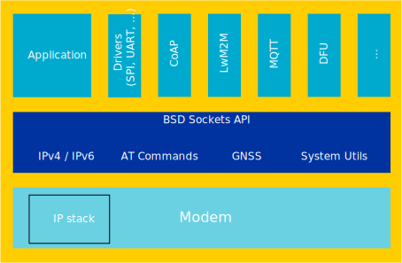
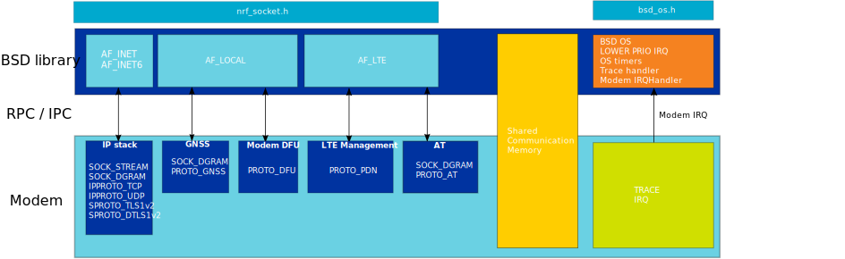

.. _bsdlib:

BSD library
###########

The BSD library is Nordic Semiconductor's implementation of the BSD Socket API, which is a set of standard function calls that can be used in an application.
This library aims to be compatible with the BSD socket standard to simplify writing and porting of existing applications.

The library has the following set of sockets:

* 8 generic sockets that can be used freely between UDP, TCP, TLS, DTLS, and AT commands
* 1 GNSS/AGPS socket
* 1 modem DFU socket
* 10 PDN sockets

Overview
********

   BSD library overview diagram

The BSD library is the primary interface to operate the nRF9160 modem in order to establish LTE-M, NBIOT, and GNSS connections.
The library abstracts away the details on memory management and synchronization allowing you to focus on writing the application using standardized API calls.

The current implementation of the BSD library supports the following features and protocols:

* TCP (client/server)
* UDP
* RAW sockets
* DTLS 1.2 client
* TLS 1.2 client
* AT commands
* GNSS
* AGPS
* PDN management
* Modem DFU

.. note::
   The DNS address management protocol is not yet implemented.

The library implements the following standard BSD functions:

* socket
* close
* bind
* listen
* accept
* connect
* recvfrom
* recv
* read
* sendto
* send
* write
* getsockopt
* setsockopt
* fcntl
* poll
* inet_pton
* inet_ntop
* getaddrinfo
* freeaddrinfo

.. note::
   Each socket supports a subset of these functions.

Library internals
*****************

The purpose of the BSD library is to communicate with the nRF9160 modem firmware.
This is done by sending events and getting responses over the Inter Processor Communication (IPC) peripheral.
To facilitate data transfer between the application and the modem, payload data is set in the shared RAM.

The modem contains a full IP and DTLS/TLS stack as well as GNSS.
The library internally communicates over a Remote Procedure Call (RPC) protocol using the IPC and the shared RAM to utilize the modules inside the modem.
You can dispatch data to and from the different modules in the modem firmware by providing the right combinations of address families, types, and protocols to the BSD library.

The BSD library aims to provide a standard programming interface on top of all of these modules so that the application developer does not have to manage all intricate details of the low-level parameters passed back and forth between the application and the modem.

The figure below shows a simplified BSD library architecture.

   BSD library architecture diagram

Porting flexibility
*******************

The BSD library has been designed in such way that you can port it to any OS.
Therefore, procedures that would normally require some kind of OS interaction, like going into sleep and IRQ reprioritization, have been moved out of the library to an open :file:`c` file in which OS-specific integration  can be implemented.
For more information, see :ref:`bsdlib_ug_porting`.

Limitations
***********

GNSS, AGPS, and Modem DFU are currently not part of the generic sockets.
Therefore, operating on them using ``poll`` is not possible yet.

PDN sockets only support ``open``, ``close``, ``setsockopt``, and ``getsockopt`` to configure a PDN with an APN name.
Therefore, there is no data communication on the socket, and it is not pollable.

Limitations on the cryptographic sockets:

* 1 TLS socket
* 2 DTLS sockets
* TCP max packet size of 4096
* TLS internal buffer size of 2.5 KB
* Only one DTLS/TLS handshake can be done at the time.
  No parallel handshake is possible.

Modem limitations on the built-in key storage:

* Max number of assets is 16 (slots).
* 1 PSK takes 1 slot.
* 1 identity takes 1 slot.
* 1 certificate might span over multiple slots depending on the size.
  Testing is needed to verify that the certificate of choice is correctly stored in the modem and can be used by referencing the security tag.

Additional documentation
************************

.. toctree::
   :maxdepth: 2
   :caption: Contents:

   doc/ug_bsdlib_porting_os
   doc/CHANGELOG
   doc/api
