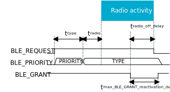

.. _bluetooth_coex_3w_interface_shared_section:

The 3-wire coexistence interface has the following timing parameters:

.. list-table:: Extended timeslot example
   :widths: 20 10 10 20 40
   :header-rows: 1

   * - Symbol
     - Value
     - Min
     - Max
     - Description
   * - t\ :sub:`type`\
     - Configurable
     - 2 μs
     -
     - Time from activating BLE_REQUEST until the direction of the requested radio activity is indicated.
   * - t\ :sub:`radio`\
     - Configurable
     - 5 μs
     -
     - Time from the expiration of t\ :sub:`type`\  until the radio can assume that the request has been granted.
   * - t\ :sub:`type`\  + t\ :sub:`radio`\
     -
     - 7 μs
     - 40 μs
     -
   * - t\ :sub:`radio_off_delay`\
     -
     -
     - 10 μs non CODED PHYs

       15 μs CODED PHYs
     - Maximum delay from the time BLE_GRANT is deactivated until the radio is turned off.
   * - t\ :sub:`max_BLE_GRANT_reactivation_delay`\
     - 100 μs
     -
     -
     - Maximum delay from the time BLE_GRANT is deactivated until it is reactivated.

During t\ :sub:`type`\, PTA samples the BLE_PRIORITY line to get the priority of the request.
An active state indicates that the request has high priority.
During t\ :sub:`radio`\, PTA samples the BLE_PRIORITY line to get the direction of the requested radio activity.
The application can configure whether a reception is indicated by an active or inactive state.
All timing diagrams assume that a reception is indicated by an active state.

   Coexistence interface timing parameters
