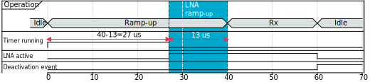
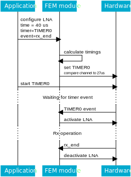
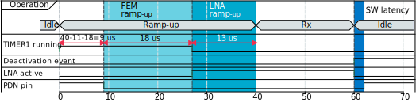
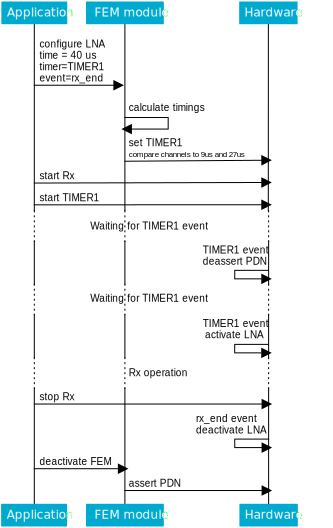

.. _mpsl_fem:

Front-end module feature
########################

.. contents::
   :local:
   :depth: 2

The front-end module feature allows the application to interface with several types of front-end modules (FEMs).
This allows an increase of the transmitted power through a Power Amplifier (PA) or an increase of the sensitivity through a Low-Noise Amplifier (LNA).
Any increase in power and sensitivity results in an increased communication range.
The exact PA and LNA gains are dependent on the specific FEM used.

Implementation
**************

Two FEM implementations are provided:

* *nRF21540 GPIO*.
  It is compatible with the nRF21540 FEM and it implements a 3-pin interface.
* *Simple GPIO*.
  It is a simplified version, made to be compatible with other front-end modules.
  It implements a 2-pin interface.

Both implementations use PA and LNA pins for controlling the FEM.
Additionally, the nRF21540 GPIO implementation uses the PDN pin for powering down the FEM internal circuits, to reduce energy consumption.

Configurable timings
********************

In both implementations, two timings can be configured:

* ``LNA time gap``, the time between the LNA activation and the start of radio reception.
* ``PA time gap``, the time between the PA activation and the start of radio transmission.

For the nRF21540, two additional timings can also be configured:

* ``TRX hold time``, the time interval for which the FEM is kept powered up after the PDN deactivation event occurs.
* ``PDN settle time``, the time interval reserved for the FEM settle, before the PA or LNA activation.

General usage
*************

The Power Amplifier and the Low-Noise Amplifier are responsible for, respectively, transmission and reception and are configured and activated independently.
The two functionalities can't be configured and set to operate simultaneously, because they share some resources.
As such, after operating with a Power Amplifier, the PA configuration must be cleared to be able to configure and use a Low-Noise Amplifier afterward, and vice versa.

Both amplifiers are controlled through activation and deactivation events.
Two types of events are supported:

* A *timer event*.
  It is the ``COMPARE`` event of a hardware timer and it can be used for both PA/LNA activation and deactivation.
* A *generic event*.
  It is any other event type and it can only be used for PA/LNA deactivation.

To prepare a generic event, it is required that the application provides the event register.
To prepare a timer event, it is required that the application provides the following:

* The instance of the timer, which the protocol has to start by itself.
* The *Compare Channels* mask, which tells the front-end module which Compare Channels of the provided Timer are free to use.
* The Start time, at which the front-end module can start preparing the PA or LNA.
* The End time, at which the front-end module must be ready for the RF procedure.

Then, the module can configure the timer to activate or deactivate the FEM accordingly, taking also into account the FEM settle time.

See below for an example of activating the LNA for Rx operation, using the following parameters:

* RX ramp-up time - 40 us
* LNA settle time - 13 us
* LNA deactivation event - ``rx_end``
* LNA activation timer - ``TIMER0``

The *RX ramp-up time* is the total time scheduled by the application.

See below for the steps needed to properly configure LNA in this example:

1 The application configures the LNA to be activated by the timer event, with the start time set to 0 us and the end time set to 40 us.
# The application provides the ``rx_end`` event as the LNA deactivation event.
# The FEM module reads the scheduled time and sets the ``TIMER0`` compare channel to 27 us, as a result of the RX ramp-up time (40 us) minus the LNA settle time (13 us).
# The application starts the RX operation.
# The application starts ``TIMER0``.

The following picture illustrates the timings in this scenario:

   Timing of LNA pin for reception

The following picture illustrates the calls between the application, the FEM module, and the hardware in this scenario:

   Sequence diagram of LNA control for reception

nRF21540 usage
**************

In the nRF21540 implementation, the PDN pin is used to power down the FEM internal circuits.
The FEM can be powered down on application request, configuring the activation timer event, similarly to PA and LNA pins.
The FEM is powered back up automatically before PA or LNA are activated.

See below for an example of controlling LNA and PDN during Rx operation, using the following parameters:

* RX ramp-up time - 40 us
* LNA settle time - 11 us
* PDN settle time - 18 us
* TRX hold time - 3 us
* LNA deactivation event - ``rx_end``
* PDN deactivation event - ``rx_end``
* PDN activation timer - ``TIMER0``
* LNA activation timer - ``TIMER1``

The *RX ramp-up time* is the total time scheduled by the application.

See below for the steps needed to properly configure LNA and PDN in this example:

* The application configures the power-down by passing ``rx_end`` as the activation event.
* The FEM module connects the activation event with the ``TIMER0`` start task through PPI and sets TRX hold time to 3 us.
* The application configures LNA to be activated by the timer event, with the start time set to 0 us and end time set to 40 us.
* The application provides the ``rx_end`` event as the LNA deactivation event.
* The FEM module reads the scheduled time and sets ``TIMER1`` compare channels to 29 us (40-11) and 11 us (29-18).
* The application starts Rx operation.
* The application starts ``TIMER1``.

The following picture illustrates the timing in this scenario:

   Timing of LNA and PDN pins for reception

The following picture presents the calls between the application, the FEM module, and the hardware in this scenario:

   Sequence diagram of LNA and PDN control for reception
