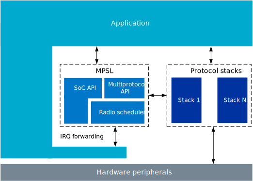
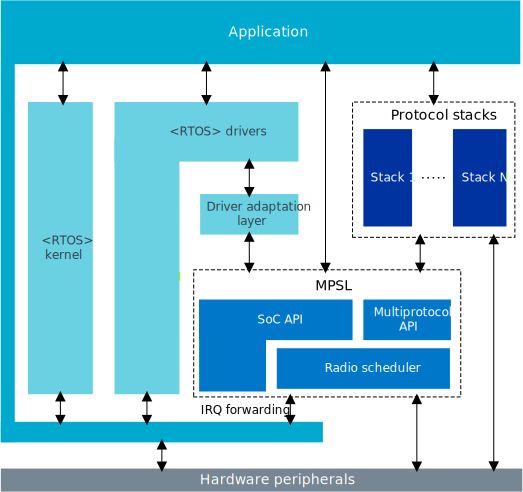

.. _mpsl_lib:

Integration notes
#################

.. contents::
   :local:
   :depth: 2

This page describes how to integrate the Multiprotocol Service Layer (MPSL) into an application.
The descriptions are valid for both RTOS and RTOS-free environments.

For the nRF53 Series, the requirements described are only relevant for applications running alongside the MPSL on the network processor.
For the nRF54H Series, some peripherals in the global domain are reserved so the requirements described here are relevant for all processors.

Several peripherals are owned by MPSL and must not be accessed directly by the application.
They are listed below, separated into instances that MPSL enables interrupts for, and ones it does not.
See the :ref:`mpsl_lib_interrupt_config` section for more information on interrupts.

For the nRF52 Series:
  Interrupts:

  * ``RTC0``
  * ``TIMER0``
  * ``ECB``

  No interrupts:

  * ``RADIO``
  * ``CLOCK``
  * ``TEMP``
  * PPI channels: ``19``, ``30``, ``31``

For the nRF53 Series:
  Interrupts:

  * ``RTC0``
  * ``TIMER0``
  * ``TIMER1``
  * ``ECB``

  No interrupts:

  * ``RADIO``
  * ``CLOCK``
  * ``TEMP``
  * DPPI channels: ``0``, ``1``, ``2``

For the nRF54H Series:
  Interrupts:

  * ``GRTC`` channels ``8`` to ``12``, interrupt ``GRTC_2_IRQn``
  * ``TIMER020``
  * ``TIMER021``
  * ``ECB030``

  No interrupts:

  * ``RADIO``
  * ``DPPIC020`` channel ``0``
  * ``DPPIC130`` channel ``0``
  * ``DPPIC132`` channel ``0``
  * ``IPCT130`` channel ``0``

For the nRF54L Series:
  Interrupts:

  * ``GRTC`` channels ``7`` to ``11``, interrupt ``GRTC_3_IRQn``
  * ``TIMER10``
  * ``TIMER20``
  * ``ECB00``

  No interrupts:

  * ``RADIO``
  * ``CLOCK``
  * ``TEMP``
  * ``DPPIC10`` channel ``0``
  * ``PPIB21`` channel ``0``
  * ``PPIB11`` channel ``0``

.. note::
   These peripherals can be used freely when MPSL is not initialized.
   Additional peripheral requirements may be set by the protocol stacks in use.

The mentioned resources related to ``RADIO`` and ``TIMER`` can be accessed directly using the :ref:`mpsl_timeslot` feature.
Limited access to some of these peripherals is provided through the following APIs:

  * ``ECB`` through :file:`mpsl_ecb.h`
  * ``CLOCK`` through :file:`mpsl_clock.h`
  * ``TEMP`` through :file:`mpsl_temp.h`

Thread and interrupt safety
***************************

The MPSL library is not reentrant.
For thread-safe operation, see the  :ref:`mpsl_lib_interrupt_config` and :ref:`mpsl_lib_scheduling` sections.

.. _mpsl_lib_interrupt_config:

Interrupt configuration
=======================

MPSL enables interrupts for the reserved instances, as well as for ``POWER_CLOCK`` and ``low_prio_irq``.
The application must enable and configure all the other interrupts.
If the Timeslot API is used for ``RADIO`` access, the application is responsible for enabling and disabling the interrupt for ``RADIO``.

The application must configure interrupts for priority level ``0`` ( :c:macro:`MPSL_HIGH_IRQ_PRIORITY` ) for ``RADIO`` and the reserved instances that have interrupts.

The following interrupts do not have real-time requirements:

 * ``POWER_CLOCK``
   It is up to the application to forward any clock-related events to :c:func:`MPSL_IRQ_CLOCK_Handler` in lower priority.
   Irrelevant events are ignored, so the application is free to forward all events for the ``POWER_CLOCK`` interrupt.

 * ``low_prio_irq``
   Low-priority work is signaled by MPSL by adding the IRQ specified in the ``low_prio_irq`` argument to :c:func:`mpsl_init`.
   When this interrupt is triggered, :c:func:`mpsl_low_priority_process` should be called as soon as possible (at least within a couple of ms).
   The application should configure this interrupt priority lower than :c:macro:`MPSL_HIGH_IRQ_PRIORITY` level (namely, a higher numerical value).
   The interrupt is enabled with :c:func:`mpsl_init` and disabled with :c:func:`mpsl_uninit` by MPSL.
   The interrupt is selected using the :kconfig:option:`CONFIG_MPSL_LOW_PRIO_IRQN` Kconfig option.
   This Kconfig option can be used to resolve conflicts with other software modules and should be left to the default value if possible.

.. _mpsl_lib_scheduling:

Scheduling
==========

The interaction of the MPSL library with protocol stacks is designed to run at two interrupt priority levels: one for the high-priority handlers, and one for the low-priority handler.
The interaction of the MPSL library with the application happens in the thread context and in the low-priority handler.

High priority
-------------

The high-priority handlers are mostly used for timing-critical operations related to radio or scheduling.
Interrupting or delaying these handlers leads to undefined behavior.

Low priority
------------

Low priority is used for background tasks that are not directly tied to the radio or scheduling.
These tasks are designed in such a way that they can be interrupted by high-priority code.
The tasks are however not designed to be interrupted by other low-priority tasks.
Therefore, make sure that only one MPSL API function is called from the application at any time.

 * All protocol stacks using MPSL must be synchronized (namely, not called concurrently) to avoid concurrent calls to MPSL functions.
 * Application must only call MPSL APIs from non-preemptible threads, or with interrupts disabled (namely, during initialization).
 * The :c:func:`mpsl_low_priority_process` function should only be called from thread context, namely, not directly from the software interrupt handler.
 * Alternatively, you can use synchronization primitives to ensure that no MPSL functions are called at the same time.

Other priorities
----------------

MPSL initialization functions, like :c:func:`mpsl_init` and :c:func:`mpsl_uninit`, are not thread-safe.
Do not call them while, for example, a protocol timeslot is in progress.
This must be enforced by application and protocol stacks.

MPSL should be initialized before any protocol stack is enabled, and uninitialized after all protocol stacks have been disabled.

Architecture diagrams
---------------------

The following image shows how the MPSL integrates into an RTOS-free environment.

   MPSL integration into an RTOS-free environment

The following image shows how the MPSL integrates into an RTOS.

   MPSL integration into an RTOS
