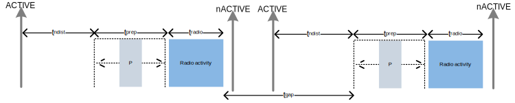
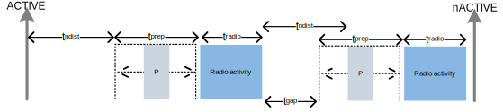
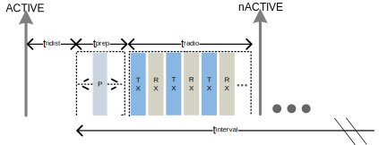
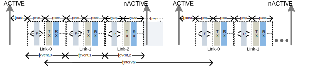
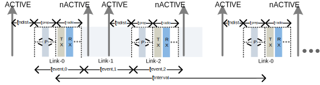
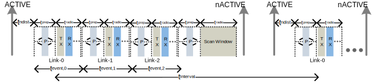
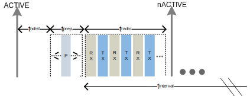
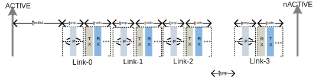
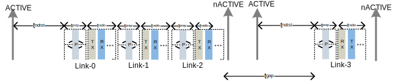

.. _mpsl_radio_notification:

Radio notifications
###################

The radio notification is a configurable feature that enables ACTIVE and INACTIVE (nACTIVE) signals from the MPSL to indicate when the radio is in use.

Radio notification signals
**************************

Radio notification signals are used to inform about radio activity.

The radio notification signals are sent right before or at the end of defined time intervals of radio operation.

To ensure that the radio notification signals behave in a consistent way, the radio notification shall always be configured when the MPSL is in an idle state with no protocol stack or other MPSL activity in progress.
Therefore, it is recommended to configure the radio notification signals directly after the MPSL has been enabled.

If it is enabled, the ACTIVE signal is sent before the MPSL starts preparing for an Event.
If the nACTIVE signal is enabled, it is sent at the end of the Radio Event.
These signals can be used to synchronize logic with the radio activity.
For example, the ACTIVE signal can be used to switch off external devices to manage peak current drawn during periods when the radio is ON, or to trigger sensor data collection for transmission during the upcoming Radio Event.

The notification signals are sent using a software interrupt.
As both ACTIVE and nACTIVE use the same software interrupt, it is up to you to manage them.
If both ACTIVE and nACTIVE are configured ON, there is always an ACTIVE signal before an nACTIVE signal.

When there is sufficient time between Radio Events (``t_gap`` > ``t_ndist``), both the ACTIVE and nACTIVE notification signals are present at each Radio Event.
The image below illustrates an example of this scenario with two Radio Events.
The figure also illustrates the ACTIVE and nACTIVE signals with respect to the Radio Events.

When there is not sufficient time between the Radio Events (``t_gap`` < ``t_ndist``), the ACTIVE and nACTIVE notification signals are skipped.
There is still an ACTIVE signal before the first event and an nACTIVE signal after the last event.
This is shown in the image below that illustrates two radio events where ``t_gap`` is too small and the notification signals are not available between the events.

You can configure ``t_ndist`` to any value between :c:macro:`MPSL_RADIO_NOTIFICATION_DISTANCE_MIN_US` and :c:macro:`MPSL_RADIO_NOTIFICATION_DISTANCE_MAX_US`.

``t_prep`` varies depending on the scheduled radio activity and might change between releases.

+----------------+--------------------------------------------------------------------------------------------------------------------+
| Label          | Description                                                                                                        |
+================+====================================================================================================================+
| ACTIVE         | The ACTIVE signal prior to a Radio Event                                                                           |
+----------------+--------------------------------------------------------------------------------------------------------------------+
| nACTIVE        | The nACTIVE signal after a Radio Event                                                                             |
+----------------+--------------------------------------------------------------------------------------------------------------------+
| P              | MPSL CPU processing in interrupt priority level 0 between the ACTIVE signal and the start of the Radio Event       |
+----------------+--------------------------------------------------------------------------------------------------------------------+
| RX             | Reception of packet                                                                                                |
+----------------+--------------------------------------------------------------------------------------------------------------------+
| TX             | Transmission of packet                                                                                             |
+----------------+--------------------------------------------------------------------------------------------------------------------+
| ``t_radio``    | The total time of a Radio Activity in a connection event                                                           |
+----------------+--------------------------------------------------------------------------------------------------------------------+
| ``t_gap``      | The time between the end of one Radio Event and ``t_prep`` for the next Radio Event                                |
+----------------+--------------------------------------------------------------------------------------------------------------------+
| ``t_interval`` | Time period of periodic protocol Radio Events (for example, Bluetooth® Low Energy connection interval)             |
+----------------+--------------------------------------------------------------------------------------------------------------------+
| ``t_prep``     | The time before first RX/TX used by the protocol stack to prepare and configure the radio                          |
+----------------+--------------------------------------------------------------------------------------------------------------------+
| ``t_ndist``    | The notification distance - the time between the ACTIVE signal and ``t_prep``                                      |
+----------------+--------------------------------------------------------------------------------------------------------------------+
| ``t_event``    | Radio event time: the sum of ``t_prep`` and ``t_radio``                                                            |
+----------------+--------------------------------------------------------------------------------------------------------------------+

Radio notification on Bluetooth Low Energy Central connection events
********************************************************************

This section clarifies the functionality of the radio notification feature when the device operates as a Bluetooth Low Energy central.
The behavior of the notification signals is shown under various combinations of active central links and scanning events.

For a comprehensive description of Bluetooth Low Energy radio event scheduling, see :ref:`softdevice_controller_scheduling`.

On a central link, multiple packets might be exchanged within a single Radio (connection) Event.
This is shown in the following  figure.

In this configuration, to guarantee that the ACTIVE notification signal is available at the configured time, the following condition must hold:

``t_ndist`` + ``t_prep`` + ``t_radio`` < ``t_interval``

A device operating as a Central might establish multiple central links and schedule them back-to-back in each connection interval.
An example of a Central with three links is shown below.

If one or several central links are dropped, an idle time interval will exist between active central links.
If the interval is sufficiently long, you might unexpectedly receive the radio notification signal.
In particular, the notification signal will be available in the idle time interval.

A device might additionally run a Scanner in parallel to the central links.
This is shown in below, where three central links and a Scanner have been established.
In this configuration, to guarantee that the ACTIVE notification signal will be available at the configured time, the following condition must hold:

``t_ndist`` + ``t_event,0`` + ``t_event,1`` + ``t_event,2`` + ``t_prep`` + ``Scan Window`` < ``t_interval``

Radio notification on Bluetooth Low Energy Peripheral connection events
***********************************************************************

This section clarifies the functionality of the radio notification feature when the device operates as a Bluetooth Low Energy Peripheral.

Radio notification events are as shown in the following figure.

In this configuration, to guarantee that the ACTIVE notification signal is available at the configured time, the following condition must hold:

``t_ndist`` + ``t_prep`` + ``t_radio`` < ``t_interval``

Radio notification with concurrent Bluetooth Low Energy Peripheral and Central connection events
************************************************************************************************

The Peripheral link events are arbitrarily scheduled with respect to each other and to the Central links.
Therefore, if one link event ends too close to the start of a peripheral event, the notification signal before the peripheral connection event might not be available.

The image below shows an example where the gap before Link-3 is too short to trigger the nACTIVE and ACTIVE notification signals.

The notification signal will arrive if the following condition is met:

``t_gap`` > ``t_ndist``

In the figure below the gap before Link-3 is sufficient to trigger the nACTIVE and ACTIVE notification signals.

