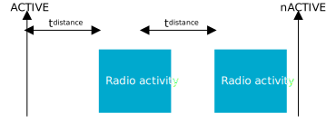

.. _mpsl_radio_notification:

Radio notifications
###################

The radio notification is a configurable feature that enables ACTIVE and INACTIVE (nACTIVE) signals from the MPSL to the application notifying it when timeslot events are active.
The application can configure how much in advance the ACTIVE signal occurs.

The radio notification signals are sent right before or at the end of an MPSL timeslot activity.
The timeslot activity may be requested by the application or another user of MPSL.
To ensure that the radio notification signals behave in a consistent way, the radio notification must always be configured when the MPSL is in an idle state with no active users.
Therefore, it is recommended to configure the radio notification signals directly after the MPSL has been enabled.

If it is enabled, the ACTIVE signal is sent before the timeslot events starts.
Similarly, if the nACTIVE signal is enabled, it is sent at the end of the timeslot event.
These signals can be used by the application developer to synchronize the application logic with the timeslot activity.
For example, if the application is using the timeslot for radio activity, the ACTIVE signal can be used to switch off external devices to manage peak current drawn during periods when the radio is ON, or to trigger sensor data collection for transmission during the upcoming event.

As both ACTIVE and nACTIVE use the same software interrupt, it is up to the application to manage them.
If both ACTIVE and nACTIVE are configured ON by the application, there will always be an ACTIVE signal before an nACTIVE signal.

When there is sufficient time between timeslot events, both the ACTIVE and nACTIVE notification signals will be present at each event.
When there is not sufficient time between the events, the ACTIVE and nACTIVE notification signals will be skipped.
There will still be an ACTIVE signal before the first event and an nACTIVE signal after the last event.

The following image shows how the ACTIVE and nACTIVE notifications are raised for both when events are far enough apart.

   
   Notifications raised for both ACTIVE and nACTIVE signals

The following image shows how one pair of ACTIVE and nACTIVE notifications is suppressed when events are placed closer than the configured radio notification distance.

   Notifications skipped for ACTIVE and nACTIVE signals
