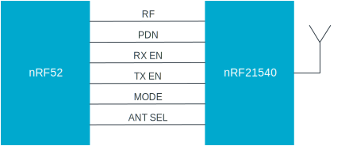

.. _rd_fem:

PA/LNA module (FEM support)
###########################

.. contents::
   :local:
   :depth: 2

The PA/LNA module increases the range of radio communication by providing APIs that act as an interface for several types of front-end modules (FEMs).
The range increase depends on the FEM used.

The radio driver library includes FEM support for the `nRF21540`_ (PCA10112).

.. _nRF21540: https://www.nordicsemi.com/Products/Low-power-short-range-wireless/nRF21540

.. _rd_fem_implementations:

FEM implementations
*******************

The following FEM implementations are available:

* :ref:`rd_fem_implementations_nrf21540`
* :ref:`rd_fem_implementations_simple`

The FEMs are controlled by the enable signals that turn on Power Amplifier (PA) or Low Noise Amplifier (LNA).

When either FEM variant is enabled, the radio driver toggles the GPIO pins, based on the radio operation.
The configuration structure allows choosing the pin polarity, and time differences between the pin toggle and the intended radio operation.

.. _rd_fem_implementations_nrf21540:

nRF21540 GPIO
=============

This interface uses the following pins:

* PA pin - Enables the Power Amplifier for the transmission.
* LNA pin - Enables the Low-Noise Amplifier for the reception.
* PDN pin - Sets the FEM into the power-down state.

The support for this interface is provided in a module provided by MPSL.
The module name corresponds to the module source path in the MPSL library.

Compared with :ref:`rd_fem_implementations_simple`, the nRF21540 GPIO provides support for the PDN pin.
This pin powers down PA, LNA, and internal FEM circuits to save energy.

.. _rd_fem_implementations_simple:

Simple GPIO
===========

This interface uses the following pins:

* PA pin - Enables Power Amplifier for transmission.
* LNA pin - Enables Low-Noise Amplifier for reception.

The support for this interface is provided in a module provided by the MPSL library

.. _rd_fem_include:

Adding FEM support
******************

Enabling the FEM support in the radio driver depends on the FEM variant used.

In both variants, each pin configuration consists of the following fields:

* `enable` -- Enables toggling of the pin.
* `active_high` -- Defines whether the pin is active high.
* `gpio_pin` -- Contains the GPIO pin number.
* `gpiote_ch_id` -- Contains the ID of the GPIOTE channel used for toggling the pin.

See the following sections for pin configuration structures with these fields.

.. _rd_fem_include_nRF21540:

Adding nRF21540 GPIO support
============================

You can configure the nRF21540 support module by using fields in the configuration structure passed to the :c:func:`mpsl_fem_nrf21540_gpio_interface_config_set` function:

* `pa_pin_config` -- Controls the Power Amplifier of the FEM.
* `lna_pin_config` -- Controls the Low Noise Amplifier of the FEM.
* `pdn_pin_config` -- Controls the Power Down control line of the FEM.
* `ppi_channels` -- Provides array for three PPI channels required for the FEM operation.
* `fem_config` -- Contains additional parameters of the module:

  * `pa_time_gap_us` -- Configures time between the activation of the PA pin and the start of the radio transmission.
    Should not be longer than Radio Ramp-Up time.
  * `lna_time_gap_us` -- Configures time between the activation of the LNA pin and the start of the radio reception.
    Should not be longer than Radio Ramp-Up time.
  * `pdn_settle_us` -- Configures time between activating the PDN pin and activating the PA/LNA pin.
  * `trx_hold_us` -- Configures time between deactivating the PA/LNA pin and deactivating the PDN pin.
  * `pa_gain_db` -- Configures PA gain.
    Ignored if the amplifier is not supporting this feature.
  * `lna_gain_db` -- Configures LNA gain.
    Ignored if the amplifier is not supporting this feature.

For more information, see also :c:func:`mpsl_fem_nrf21540_gpio_interface_config_t`.

.. _rd_fem_include_simple:

Adding Simple GPIO support
==========================

Simple GPIO FEM interface can be configured by using fields in the configuration structure passed to the :c:func:`mpsl_fem_simple_gpio_interface_config_set` function:

* `pa_pin_config` -- Controls the Power Amplifier of the FEM.
* `lna_pin_config` -- Controls the Low Noise Amplifier of the FEM.
* `ppi_channels` -- Provides array for two PPI channels required for the FEM operation.
* `fem_config` -- Contains additional parameters of the module:S

    * `pa_time_gap_us` -- Configures time between the activation of the PA pin and the start of the radio transmission.
      Should not be longer than Radio Ramp-Up time.
    * `lna_time_gap_us` -- Configures time between the activation of the LNA pin and the start of the radio reception.
      Should not be longer than Radio Ramp-Up time.
    * `pa_gain_db` -- Configures PA gain.
      Ignored if the amplifier is not supporting this feature.
    * `lna_gain_db` -- Configures LNA gain.
      Ignored if the amplifier is not supporting this feature.

For more information, see also :c:func:`mpsl_fem_simple_gpio_interface_config_t`.

.. _rd_fem_include_pins:

Configuring pins
================

Other FEM pins (like **ANT_SEL**, **MODE**, **MOSI**, **MISO**, **CLK**, **CSN** for the nRF21540) are not supported by the MPSL library and must be set to the safe state described in the specific FEM documentation (for example, `nRF21540 Product Specification`_).

.. _nRF21540 Product Specification: https://infocenter.nordicsemi.com/topic/struct_fem/struct/nrf21540_ps.html

.. note::
   The current implementation of the FEM support does not implement the SPI interface or MODE pin support and does not change the transmission power after the initialization.

When the FEM support is enabled and configured, additional peripherals are required by the MPSL's PA/LNA module for toggling the GPIO pins.
These peripherals are defined in the configuration structure passed either to the :c:func:`mpsl_fem_nrf21540_gpio_interface_config_set` or :c:func:`mpsl_fem_simple_gpio_interface_config_set` function, depending on the FEM variant.
