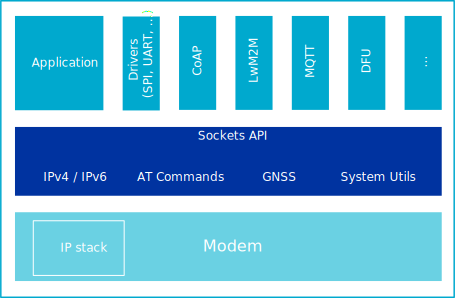

.. _nrf_modem:

Modem library
#############
The Modem library is Nordic Semiconductor's Berkeley-like socket implementation, which is a set of standard function calls that can be used in an application.
This library aims to be compatible with the socket standard to simplify writing and porting of existing applications.

The library has the following set of sockets:

* 8 generic sockets that can be used freely between UDP, TCP, TLS, DTLS, and AT commands
* 1 GNSS/AGPS socket
* 1 modem DFU socket
* 10 PDN sockets

The Modem library is the primary interface for operating the nRF9160 modem and to establish LTE-M and NB-IoT connections, and receive position data (GPS).
The library abstracts away the details on memory management and synchronization, allowing you to focus on writing the application using standardized API calls.

   Modem library overview diagram

To get started with socket programming, you should check out some introductions and tutorials, such as `Beej's Guide to Network Programming`_.

The Modem library has been designed in such way that you can port it to any RTOS.
Therefore, procedures that would normally require some kind of OS interaction, like going into sleep mode and IRQ reprioritization, have been moved out of the library to a :file:`.c` file in which OS-specific integration can be implemented.
For more information, see :ref:`nrf_modem_ug_porting`.

.. toctree::
   :maxdepth: 2
   :caption: Subpages:

   doc/supported_features
   doc/limitations
   doc/architecture
   doc/security_tags
   doc/extensions
   doc/ug_nrf_modem_porting_os
   doc/CHANGELOG
   doc/api
