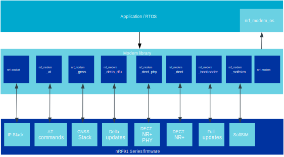

.. _architecture:

Library architecture
####################

The purpose of the Modem library is to communicate with the nRF9160 modem firmware.
This is done by sending events and getting responses over the Inter Processor Communication (IPC) peripheral.
To facilitate data transfer between the application and the modem, payload data is set in the shared RAM.

The modem contains a full IP and DTLS/TLS stack as well as GNSS.
The library internally communicates over a Remote Procedure Call (RPC) protocol using the IPC and the shared RAM to utilize the protocol stacks inside the modem.
You can dispatch data to and from the different modules in the modem firmware by providing the right combinations of address families, types, and protocols to the Modem library.

The Modem library aims to provide a standard programming interface on top of the RPC protocol, to facilitate application development.

The following figure shows a simplified Modem library architecture.

   Modem library architecture diagram
