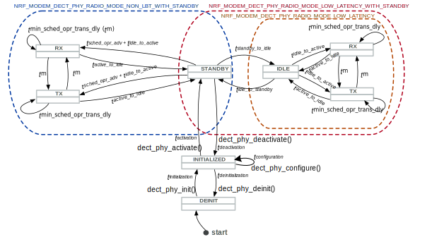

.. _nrf_modem_dect_phy:

DECT NR+ physical layer
#######################

.. contents::
   :local:
   :depth: 2

The DECT physical layer (PHY) interface in the Modem library is used to control the DECT NR+ PHY in the DECT NR+ PHY firmware.

The DECT NR+ PHY firmware is a variant of the nRF91x1 firmware with a different radio technology than the cellular firmware.
In particular, the DECT NR+ PHY firmware does not support cellular operation or the Global Navigation Satellite System (GNSS).

For details about the key hardware capabilities of the nRF91x1 DKs and their DECT NR+ PHY firmware implementation with regard to the DECT NR+ standard, refer to the `nRF9151 DECT NR+ product specification`_ or the `nRF9161 DECT NR+ product specification`_, depending on the SiP you are using.

.. note::
   To obtain the DECT NR+ PHY firmware, you must contact the Nordic Semiconductor sales department.

For more details about the Modem library features that are available for each firmware variant, see :ref:`nrf_modem_variants`.

Regulations
***********

DECT NR+ operates on free but regulated radio channels.
The availability of these channels and the exact regulations covering their use varies in different countries.

.. note::
   It is your responsibility to operate the devices according to the local regulation, in all situations.

.. caution::
   The European Telecommunications Standards Institute (ETSI) has published European Normative document `ETSI EN 301 406-2`_, which restricts operation on specific absolute channel frequency numbers within the available range.
   If you plan to operate a device using the DECT NR+ PHY firmware in territories where ETSI EN 301 406-2 is applicable, you must refer to table 4.3.2.3-2 to see which channel frequency numbers you are allowed to use.

   The Federal Communication Commission (FCC) rules and regulations for radio frequency devices are located in `47 CFR Part 15`_.
   If you plan to operate a device using the DECT NR+ PHY firmware in territories where 47 CFR Part 15 is applicable, you must refer to `47 CFR Part 15.323`_ to see which channel frequency numbers you are allowed to use.

Protocol stack overview
***********************

The physical layer is only one part of the DECT-2020 New Radio protocol stack (DECT NR+).

The whole DECT NR+ protocol stack consists of four layers:

* Physical layer (PHY).
* Medium Access Control (MAC) layer, including co-existing and channel access operation.
* Data link control (DLC), including routing, segmentation, and re-assembly of messages.
* Convergence layer (CVG), including message flow control, multiplexing, and transmission service level control.

For more details about the DECT NR+ protocol stack, refer to the `nRF9151 DECT NR+ product specification`_ or the `nRF9161 DECT NR+ product specification`_, depending on the SiP you are using.

The DECT NR+ PHY firmware implements only the physical layer of the protocol stack.

.. note::
   To pass the certification, a MAC layer implementation is required, and main parts of its operation are verified during the certification phase.

General operation
*****************

The DECT PHY stack has the following three states:

* Deinitialized, deactivated
* Initialized, deactivated
* Initialized, activated

The DECT PHY interface offers four functions to manipulate the DECT PHY stack state:

* :c:func:`nrf_modem_dect_phy_init`
* :c:func:`nrf_modem_dect_phy_deinit`
* :c:func:`nrf_modem_dect_phy_activate`
* :c:func:`nrf_modem_dect_phy_deactivate`

Initialization
==============

Initializing the DECT PHY readies the hardware resources for the PHY in the modem.

Before initializing the DECT PHY, the application must do the following:

#. Initialize the Modem library by calling the :c:func:`nrf_modem_init` function.
   This also turns on the modem.
#. Register the event handler for DECT PHY operations by calling the :c:func:`nrf_modem_dect_phy_event_handler_set` function.

Afterwards, the application can initialize the DECT PHY interface by calling the :c:func:`nrf_modem_dect_phy_init` function.

Only on nRF9131 Series devices, the DECT NR+ PHY firmware locks the calibration data the very first time the DECT PHY is initialized.

To begin receiving and transmitting data, the DECT PHY interface must be configured and activated first.

Configuration
=============

The DECT PHY must be configured using the :c:func:`nrf_modem_dect_phy_configure` function each time before it is activated.

Only on nRF9151 Series devices, the application can configure band 4 support during initialization by setting the :c:member:`nrf_modem_dect_phy_config_params.band_group_index` field to ``1``.

.. note::
   DECT NR+ band 4 is supported by the nRF9151 LACA A0 SiP for R&D evaluation purposes.
   The nRF9151 LACA A0AB SiP will be qualified for DECT NR+ band 4 support.

.. important::
   When operating on band 4, you must not use the carriers outside the range of 525 to 551 as it interferes with other radio devices, including LTE devices.

Activation
==========

Once the DECT PHY software stack has been configured, it can be activated in a given radio mode using the :c:func:`nrf_modem_dect_phy_activate` function.
When the DECT PHY software stack is in an activated state, it is possible to start receiving and transmitting data.
Different radio modes have different performance and latency.

Radio modes
===========

The radio modes have implications on operation latency and power consumption.
The DECT modem supports the following three user-configurable radio modes:

* ``LOW_LATENCY`` - This mode has the lowest latency, the best RX/TX switching performance, and the highest idle power consumption.
  This is the only mode that supports immediate start operations, that is, operations that have configured start time as zero.
* ``LOW_LATENCY_WITH_STANDBY`` - This mode has the same RX/TX switching performance as the low latency mode, but higher operation start-up latency due to the radio entering standby mode when possible.
  Idle power consumption is thus lower compared to the low latency mode.
* ``NON_LBT_WITH_STANDBY`` - This mode has the lowest idle power consumption, due to the modem entering standby mode when possible and not using Listen-Before-Talk, at the cost of higher start-up latency.

In the figure and in the codes, these radio mode names are prefixed by ``NRF_MODEM_DECT_PHY_RADIO_MODE_*``.

   Radio modes and latencies

The figure shows the difference between the ``LOW_LATENCY`` mode and the ``NON_LBT_WITH_STANDBY`` mode.
In ``NON_LBT_WITH_STANDBY`` mode, the modem automatically returns to the ``STANDBY`` state, where both the receiver (RX) and transmitter (TX) are off.
While in the ``IDLE`` state of ``LOW_LATENCY`` mode, the RX and TX remain partially activated.
This enables faster radio operations but results in higher current consumption.
The ``NON_LBT_WITH_STANDBY`` activates either TX or RX, and therefore Listening Before Talk (LBT) is not available in this mode.

The following lists the timing symbols of transition times between the states and operation latencies and their corresponding API parameters:

* :math:`t_{scheduled\_operation\_advance}` - ``scheduled_operation_advance``
* :math:`t_{idle\_to\_active}` - ``idle_to_active``
* :math:`t_{scheduled\_operation\_advance + idle\_to\_active}` - ``scheduled_operation_advance`` + ``idle_to_active``
* :math:`t_{minimum\_scheduled\_operation\_transition\_delay}` - ``minimum_scheduled_operation_transition_delay``
* :math:`t_{active\_to\_idle}` - ``active_to_idle``

The following lists the timing symbols of configuration duration and their corresponding API parameters:

* :math:`t_\text{activation}` - ``activation``
* :math:`t_\text{deactivation}` - ``deactivation``
* :math:`t_\text{configuration}` - ``configuration``
* :math:`t_\text{initialization}` - ``initialization``
* :math:`t_\text{deinitialization}` - ``deinitialization``

As an example, the minimum scheduling delay in ``LOW_LATENCY_WITH_STANDBY`` mode can be derived from the required state transitions.
Any modem operation from the ``STANDBY`` state must go through the ``IDLE`` state before reaching the RX or TX state.
Thus, the operation must be scheduled at the time as set in :math:`t_{scheduled\_operation\_advance}` + :math:`t_{idle\_to\_active}` in advance to ensure that the on‑air activity begins exactly at the desired time.
In this context, ``rssi`` operations are executed in the RX state, as shown in the figure.

You must ensure that the time between any two scheduled operations is not shorter than the value specified by :math:`t_{minimum\_scheduled\_operation\_transition\_delay}`.

The modem always goes to the lowest possible current-consumption state based on the known radio operation schedule in the given configured radio mode.
For example, in the ``LOW_LATENCY_WITH_STANDBY`` mode, after an RX operation completes, the modem autonomously evaluates whether sufficient time exists to drop to the ``STANDBY`` state or to ``IDLE`` and come back to the next TX or RX operation.
If the timing does not permit this, the modem takes a shortcut to the next RX or TX operation.
Within that ``STANDBY`` state, the modem autonomously enters the ``SLEEP`` mode if the time gap is long enough.
The possible ``SLEEP`` wake-up times are factored into :math:`t_{scheduled\_operation\_advance}`.

In ``LOW_LATENCY`` mode, the modem also accepts ``0`` as a radio operation start time.
A value of ``0`` is interpreted as a best-effort command, where the modem initiates the operation as fast as possible based on the current state and the modem state transition times.
To achieve the most power-efficient modem operation, the radio operation requests should be sent as early as possible so that the modem can make maximum use of low-power operating modes based on the scheduled operations.
It is preferred to schedule non-overlapping radio operations in advance and to avoid as-fast-as-possible commands.

For the radio current consumption for the various modem operating states, see `DECT NR+ current consumption`_.

Deactivation
============

The DECT PHY software stack can be deactivated using the :c:func:`nrf_modem_dect_phy_deactivate` function.
When in the deactivated state, the DECT PHY software stack can be configured with different parameters.

Deinitialization
================

The DECT PHY software stack can be de-initialized using the :c:func:`nrf_modem_dect_phy_deinit` function, releasing all hardware resources.
Once de-initialized, the DECT PHY interface can be re-initialized by only calling the :c:func:`nrf_modem_dect_phy_init` function.

Temperature monitoring
======================

The DECT PHY interface reports the current SiP temperature as measured by the DECT NR+ PHY firmware in all radio operation events, and upon initialization.
This allows the application to track the changes in temperature and adjust further scheduling of operations accordingly, to ensure the device remains within safe operating temperatures.

The DECT NR+ PHY firmware has an internal temperature protection mechanism that prevents the SiP from operating above safe temperature limits.
The operating temperature limit is reported upon initialization by the :c:enumerator:`NRF_MODEM_DECT_PHY_EVT_INIT` event, in the :c:member:`nrf_modem_dect_phy_init_event.temperature_limit` parameter.

If the temperature threshold is reached, the modem rejects further scheduling of radio operations with the :c:enumerator:`NRF_MODEM_DECT_PHY_ERR_TEMP_HIGH` error.

In this event, the application must de-initialize the DECT PHY software stack by calling the :c:func:`nrf_modem_dect_phy_deinit` function and allow the device to cool.
This will cancel all scheduled operations, with the :c:enumerator:`NRF_MODEM_DECT_PHY_ERR_OP_CANCELED` error in their relative events.

The application can then re-initialize the DECT PHY interface by calling :c:func:`nrf_modem_dect_phy_init`, and read the current measured temperature in the :c:struct:`nrf_modem_dect_phy_init_event` event to ensure the temperature has decreased below the allowed threshold.

Voltage monitoring
==================

The DECT PHY interface reports the voltage as measured by the DECT NR+ PHY firmware in all radio operation events, and upon initialization.
This allows the application to track the changes in voltage and adjust accordingly to ensure the device operates within expected voltage levels.

Physical layer capabilities
===========================

The application can retrieve the DECT NR+ PHY firmware physical layer capabilities by calling the :c:func:`nrf_modem_dect_phy_capability_get` function.
The list of supported capabilities is returned to the application in the :c:enumerator:`NRF_MODEM_DECT_PHY_EVT_CAPABILITY` event.

Scheduling operations
*********************

The DECT PHY interface allows to schedule radio operations for execution by the scheduler of the DECT NR+ physical layer in the DECT NR+ PHY firmware.
Due to the nature of a radio scheduler, which allows radio operations to be executed at a specific time in the future, all radio operations in the DECT PHY interface are asynchronous and their completion is signaled to the application using events.

A radio operation can be scheduled to execute at a specific time in the future or immediately if the radio is not currently executing any other operation.

All events for radio operations carry an application-defined handle that can be used to identify the operation.

Modem time and operation latency
================================

Operation execution is scheduled by the application according to the modem time, which is a 64-bit counter kept by the modem.

All DECT PHY events provide the value of the modem time counter at the moment the event was sent by the modem core to the application core.
This provides a way for the application to track the modem time without explicitly querying the modem for it.
If necessary, the application can retrieve the modem time counter value by calling the :c:func:`nrf_modem_dect_phy_time_get` function.

The current radio mode, the radio state transitions between operations, and scheduling overhead all affect the total operation latency and must be taken into account during scheduling of operations.

These latencies are measured and can be retrieved by the application using the :c:func:`nrf_modem_dect_phy_latency_get` function.

Examples of scheduling
======================

Example 1: Immediate execution

Pre-conditions:

* The DECT PHY radio mode is :c:enumerator:`NRF_MODEM_DECT_PHY_RADIO_MODE_LOW_LATENCY`.
* There are no scheduled or ongoing operations.

Let ``t`` be the current modem time.

The operation startup latency ``startup`` is indicated:

* For RX operations (RX, RSSI or RX with RSSI) by :c:member:`nrf_modem_dect_phy_latency_info.idle_to_active`
* For TX operations by :c:member:`nrf_modem_dect_phy_latency_info.idle_to_active`

The actual start time of the operation can be calculated as ``t + startup``.

Stopping the operation also incurs latency, which includes the time to close the RF channel and send the operation response after the operation's duration.

The stop latency ``stop`` depends on the operation, and is indicated:

* For an RX operation - :c:member:`nrf_modem_dect_phy_latency_info.active_to_idle_rx`
* For an RSSI operation - :c:member:`nrf_modem_dect_phy_latency_info.active_to_idle_rssi`
* For an RX operation with RSSI measurements - :c:member:`nrf_modem_dect_phy_latency_info.active_to_idle_rx_rssi`
* For a TX operation - :c:member:`nrf_modem_dect_phy_latency_info.active_to_idle`
* For a TX_RX operation - :c:member:`nrf_modem_dect_phy_latency_info.active_to_idle_rx`

Thus, for a given operation duration of ``duration``, the earliest time at which the next operation can be executed can be calculated as: ``t + startup + duration + stop``.

Example 2: Scheduling one operation after another

Pre-conditions:

* The DECT PHY is activated.
* There is one scheduled or ongoing operation (operation 1).

Let ``t`` represent the current modem time.
Let ``start_time_op1`` and ``duration_op1`` be the start time and duration of operation 1 respectively.

The operation startup latency ``startup`` is indicated by the following parameters:

* :c:member:`nrf_modem_dect_phy_latency_info.idle_to_active` for RX operations (RX, RSSI or RX with RSSI).
* :c:member:`nrf_modem_dect_phy_latency_info.idle_to_active` for TX operations.

Since the operation is scheduled, we must include the additional startup delay associated with scheduled operations for the current radio mode.
Let ``sched_startup`` be the value of this delay, as indicated by :c:member:`nrf_modem_dect_phy_latency_info.scheduled_operation_startup`.

The earliest start time of the operation is then calculated by adding both the initial startup delay and the scheduled startup delay to the current modem time, expressed as: ``t + startup + sched_startup``.

The earliest time at which the operation can be scheduled after another one must include the additional delay associated with transitioning from one scheduled operation to the next, according to the current radio mode.
Let ``sched_transition`` be the value of this delay, as indicated by :c:member:`nrf_modem_dect_phy_latency_info.scheduled_operation_transition`.

In conclusion, the start time of the operation being scheduled must be at least as large as the minimum between ``t + startup + sched_startup`` and ``start_time_op1 + duration_op1 + sched_transition``.

Radio operations
****************

The DECT PHY interface offers the following three radio operations:

* Transmission (TX)
* Reception (RX)
* RSSI measurement

Each of these operations can be performed with different parameters.

The completion of a radio operation is signaled to the application by the invocation of the :c:enumerator:`NRF_MODEM_DECT_PHY_EVT_COMPLETED` event.

The event carries the same handle that was specified by the application at the time the operation was scheduled.

Transmission
============

The application can schedule a transmission by calling the :c:func:`nrf_modem_dect_phy_tx` function.

The operation is asynchronous, and the successful completion of the :c:func:`nrf_modem_dect_phy_tx` function only signals that the request was sent to the modem.
When the operation has completed, its result is signaled to the application in the :c:enumerator:`NRF_MODEM_DECT_PHY_EVT_COMPLETED` event.
If any error has occurred in scheduling or executing the operation, it is returned in the event.

The operation has several parameters including Listen Before Talk (LBT) period and threshold.

Channel frequency
-----------------

The DECT radio band is divided into different channels, as described in chapter 5.2 of `ETSI TS 103 636-2`_.

The absolute radio channel frequency used for transmission is controlled by the :c:member:`nrf_modem_dect_phy_tx_params.carrier` field on the transmission parameters.

.. note::
   DECT NR+ band 4 is supported by the nRF9151 LACA A0 SiP for R&D evaluation purposes.

   The nRF9151 LACA A0AB SiP will be qualified for DECT NR+ band 4 support.

.. important::
   Follow the local regulations when transmitting.
   To see which frequency channels can be used:

   * In the European Union, you must refer to table 4.3.2.3-2 of `ETSI EN 301 406-2`_.
   * In the USA, you must refer to `47 CFR Part 15.323`_.
   * In all other territories, you must follow the local regulations.

   When operating on band 4, you must not use the carrier outside the range of 525 to 551 as they interfere with other radio devices, including LTE devices.

Transmission length
-------------------

The length of a *transmission* is expressed in sub-slots (or half slots), where each sub-slot has a duration given by the subcarrier scaling factor.
A transmission can take up to 15 sub-slots, where the number of bits per sub-slot is decided by the chosen modulation scheme, as shown in the table below.
The length of the *data* being transmitted is expressed in bytes, and is specified by the :c:member:`nrf_modem_dect_phy_tx_params.data_size` parameter.

.. note::
   When transmitting, the length in bytes of the data being transmitted must match exactly the number of bits that can be transmitted during the length of the transmission in sub-slots.

For example, with modulation scheme 0 (MSC 0), a transmission with a data length of 17 bytes (136/8) would take exactly 2 sub-slots.
Using the same modulation scheme, a transmission of 3 sub-slots transmits 33 bytes (264/8), and therefore, the length of the data being transmitted must be exactly 33 bytes.

.. table:: Bits per subslot index with given modulation scheme

   +---------------------+------+------+-------+-------+-------+-------+-------+-------+-------+-------+-------+-------+-------+-------+-------+-------+
   | MSC / Subslot-index | 0    | 1    | 2     | 3     | 4     | 5     | 6     | 7     | 8     | 9     | 10    | 11    | 12    | 13    | 14    | 15    |
   +---------------------+------+------+-------+-------+-------+-------+-------+-------+-------+-------+-------+-------+-------+-------+-------+-------+
   | MCS 0               | 0    | 136  | 264   | 400   | 536   | 664   | 792   | 920   | 1064  | 1192  | 1320  | 1448  | 1576  | 1704  | 1864  | 1992  |
   +---------------------+------+------+-------+-------+-------+-------+-------+-------+-------+-------+-------+-------+-------+-------+-------+-------+
   | MCS 1               | 32   | 296  | 552   | 824   | 1096  | 1352  | 1608  | 1864  | 2104  | 2360  | 2616  | 2872  | 3128  | 3384  | 3704  | 3960  |
   +---------------------+------+------+-------+-------+-------+-------+-------+-------+-------+-------+-------+-------+-------+-------+-------+-------+
   | MCS 2               | 56   | 456  | 856   | 1256  | 1640  | 2024  | 2360  | 2744  | 3192  | 3576  | 3960  | 4320  | 4768  | 5152  | 5536  | --    |
   +---------------------+------+------+-------+-------+-------+-------+-------+-------+-------+-------+-------+-------+-------+-------+-------+-------+
   | MCS 3               | 88   | 616  | 1128  | 1672  | 2168  | 2680  | 3192  | 3704  | 4256  | 4768  | 5280  | --    | --    | --    | --    | --    |
   +---------------------+------+------+-------+-------+-------+-------+-------+-------+-------+-------+-------+-------+-------+-------+-------+-------+
   | MCS 4               | 144  | 936  | 1736  | 2488  | 3256  | 4024  | 4832  | 5600  | --    | --    | --    | --    | --    | --    | --    | --    |
   +---------------------+------+------+-------+-------+-------+-------+-------+-------+-------+-------+-------+-------+-------+-------+-------+-------+

.. note::
   For higher MCS levels, a better Signal-to-Noise Ratio (SNR) is needed to correctly decode the transmissions.
   Depending on transmission power and range, higher MCS levels might not be reached.

It is recommended to use transmission lengths of at most 4-6 sub-slots.

Hybrid ARQ
----------

The application can schedule a hybrid ARQ response transmission (HARQ feedback) by calling the :c:func:`nrf_modem_dect_phy_tx_harq` function.
A HARQ response transmission can be scheduled after a reception on the physical control channel (PCC).

Scheduling a HARQ response is time critical and therefore it must be done directly from the :c:enumerator:`NRF_MODEM_DECT_PHY_EVT_PCC` event.
The MAC must have prepared data towards possible HARQ recipients in advance, so that it can directly call this function without further delays.

.. note::
   The application must always generate the HARQ feedback as NACK.

Because at the time the HARQ feedback transmission is scheduled the PDC is still being processed, the modem automatically adjusts the feedback to ACK afterwards, based on the PDC checksum data calculation.

Reception
=========

The application can schedule a reception by calling the :c:func:`nrf_modem_dect_phy_rx` function.

The operation is asynchronous, and the completion of the :c:func:`nrf_modem_dect_phy_rx` function only signals that the request was sent to the modem.

During reception, data received on the physical control channel (PCC) and on the physical data channel (PDC) is sent to the application in the :c:enumerator:`NRF_MODEM_DECT_PHY_EVT_PCC` and :c:enumerator:`NRF_MODEM_DECT_PHY_EVT_PDC` events, respectively.
Any CRC errors on the physical control channel and on the physical data channel are sent to the application in the :c:enumerator:`NRF_MODEM_DECT_PHY_EVT_PCC_ERROR` and :c:enumerator:`NRF_MODEM_DECT_PHY_EVT_PDC_ERROR` events, respectively.

When the operation has completed, its result is signaled to the application in the :c:enumerator:`NRF_MODEM_DECT_PHY_EVT_COMPLETED` event.
If any error has occurred in scheduling or executing the operation, it is returned in the event.

Reception modes
---------------

A reception operation can have the following three different reception modes:

* Continuous - The reception is continued after PDC reception, up to its ``duration``.
* Semi-continuous - The reception is continued after PDC reception, unless it is a unicast PDC.
* One-shot - The reception is terminated after PDC reception.

In all reception modes, the reception will not extend past the operation duration specified in the :c:member:`nrf_modem_dect_phy_rx_params.duration` parameter.

Reception with RSSI measurement
-------------------------------

A reception operation can be combined with an RSSI measurement operation by configuring the :c:member:`nrf_modem_dect_phy_rx_params.rssi_interval` parameter.

RSSI measurement
================

The application can schedule an RSSI measurement operation by calling the :c:func:`nrf_modem_dect_phy_rssi` function.

The operation is asynchronous, and the completion of the :c:func:`nrf_modem_dect_phy_rssi` function only signals that the request was sent to the modem.

RSSI measurements are sent to the application in the :c:enumerator:`NRF_MODEM_DECT_PHY_EVT_RSSI` event at a configurable interval, as specified by the :c:member:`nrf_modem_dect_phy_rssi_params.reporting_interval` field in the operation parameters.

When the operation has completed, its result is signaled to the application in the :c:enumerator:`NRF_MODEM_DECT_PHY_EVT_COMPLETED` event.
If any error has occurred in scheduling or executing the operation, it is returned in the event.

Combined TX and RX operation
============================

You can schedule a combined TX and RX operation by calling the :c:func:`nrf_modem_dect_phy_tx_rx` function.
Scheduling two operations at once has the advantage of being faster, that is, it has a lower latency than scheduling the two halves of the operation separately.

The start time of the RX operation is relative to the completion of the TX operation.

The operations will be executed one after the other, starting with the TX operation.
The RX operation will be executed only if the TX operation has been completed successfully.

When the TX or RX part of the operation has completed, either successfully or unsuccessfully, its result is sent to the :c:enumerator:`NRF_MODEM_DECT_PHY_EVT_COMPLETED` event.

Canceling operations
====================

The application can cancel operations using the :c:func:`nrf_modem_dect_phy_cancel` function and specifying the handle of the operation to be canceled.

When an operation is canceled, the :c:enumerator:`NRF_MODEM_DECT_PHY_EVT_COMPLETED` event is sent to the application.

If the operation was not executing, the event carries the error :c:enumerator:`NRF_MODEM_DECT_PHY_ERR_OP_CANCELED`.
Otherwise, it reports a success.

Afterwards, the :c:enumerator:`NRF_MODEM_DECT_PHY_EVT_CANCELED` event is sent to the application to indicate that the cancellation operation has completed.
