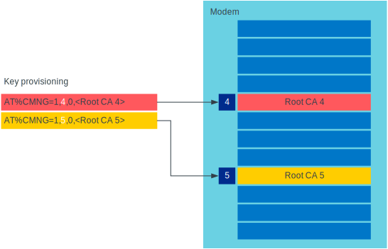

TLS/DTLS configuration
######################

.. contents::
   :local:
   :depth: 2

The IP stack in the nRF91 Series modem firmware has TLS and DTLS support.

.. _security_tags:

Security tags
*************

To use the cryptographic functions in the modem, the application must provision the security credentials to the modem.
To be able to provision credentials, the modem must be in offline mode.
The credentials are provisioned through AT commands.
For more information, See `Credential storage management %CMNG`_ section in the nRF9160 AT Commands Reference Guide or the same section in the `nRF91x1 AT Commands Reference Guide`_ depending on the SiP you are using.
If you are using the |NCS| to build your application, you can use the :ref:`nrf:modem_key_mgmt` library to manage credentials.
If you prefer a graphical tool, use `Cellular Monitor`_ instead.
To manage credentials with Cellular Monitor, your device must be running an |NCS| application.

The following figure shows how security tags are provisioned using AT commands:

.. figure:: images/security_tags.svg
   :alt: Provisioning credentials with a security tag

   Provisioning credentials with security tag ``1``

As you see, each set of credentials is identified by a security tag (``sec_tag``), which is referenced when a DTLS/TLS socket is created.

The security tag must be attached to a socket using the :c:func:`nrf_setsockopt` function before connecting (through TCP) or transferring data (through UDP).
The following code snippet shows how to set up strict peer verification for a socket and configure the socket to use the security tag ``sec_tag``:

.. code-block:: c

	/* Let 'fd' be a valid UDP or TCP socket descriptor. */

	int err;
	int verify;
	sec_tag_t sec_tag_list[] = { sec_tag };

	enum {
		NONE = 0,
		OPTIONAL = 1,
		REQUIRED = 2,
	};

	verify = REQUIRED;

	err = nrf_setsockopt(fd, NRF_SOL_SECURE, NRF_SO_SEC_PEER_VERIFY, &verify, sizeof(verify));
	if (err) {
		/* Failed to set up peer verification. */
		return -1;
	}

	err = nrf_setsockopt(fd, NRF_SOL_SECURE, NRF_SO_SEC_TAG_LIST, sec_tag_list, sizeof(sec_tag_list));
	if (err) {
		/* Failed to set up socket security tag. */
		return -1;
	}

It is possible to use multiple security tags.
If a list is provided, one of the matching tags is used when handshaking.
For example, you could define the security tag list as follows::

   sec_tag_t sec_tag_list[] = { 4, 5 };

In this case, either security tag 4 or security tag 5 can be used for operations on the socket.

   Using multiple security tags

TLS traffic decryption
**********************

Starting from modem firmware v2.0.0, Transport Layer Security (TLS) traffic can be decrypted with Nordic tools if the TLS session is created using certificates stored to security tags ranging between the values specified in :c:macro:`NRF_SEC_TAG_TLS_DECRYPT_0` and :c:macro:`NRF_SEC_TAG_TLS_DECRYPT_19`.

.. important::
   These security tags must be used only for test and development purposes.

Testing TLS traffic decryption
==============================

Before you start testing TLS traffic decryption, make sure that the following prerequisites are satisfied:

#. The device runs an application that supports TLS.
   The TLS session is created using certificates stored to tags ranging between the values specified in ``NRF_SEC_TAG_TLS_DECRYPT_0`` and ``NRF_SEC_TAG_TLS_DECRYPT_19``.
#. The device has modem traces enabled.
   For information on modem traces and how to enable them, see the :ref:`nrf_modem_trace` documentation.
#. Modem firmware v2.0.0 or higher is programmed on your device.
   For information on how to find the modem firmware version, see the `Revision Identification +CGMR`_ documentation.
#. Wireshark is installed on your machine.
   For information on Wireshark and how to install it, see `Wireshark`_.

Complete the following steps to test TLS traffic decryption:

#. Connect the kit to the computer using a USB cable.
#. Open the `Cellular Monitor`_ desktop application and connect the device.
#. Select :guilabel:`Autoselect` from the **Modem trace database** drop-down menu, or a modem firmware version that is programmed on the device.
#. Make sure that :guilabel:`Open in Wireshark` is selected.
#. Click :guilabel:`Open Serial Terminal` and keep the terminal window open (optional).
#. Click :guilabel:`Start` to begin the modem trace.
   The button changes to :guilabel:`Stop` and is greyed out.
#. In Wireshark, observe the incoming traffic.
   Successfully decrypted TLS traffic will be indicated by an additional layer named :guilabel:`Decrypted TLS` in the packet details pane.
   Expand this layer to inspect the decrypted content.

Supported cipher suites
-----------------------

See the `nRF9160 modem TLS cipher suites`_ or `nRF91x1 modem TLS cipher suites`_ summary page, depending on the SiP you are using, for a full list of TLS/DTLS cipher suites supported by the modem.

Each cipher suite is recognized by an official identification number, which is registered at `IANA`_.
You can narrow down the set of cipher suites that is used for a specific TLS/DTLS connection with :c:func:`nrf_setsockopt`.
For example, see the following code:

.. code-block:: c

	/* TLS_ECDHE_RSA_WITH_AES_256_CBC_SHA */
	nrf_sec_cipher_t cipher_list[] = { 0xC014 };

	err = nrf_setsockopt(fd, NRF_SOL_SECURE, NRF_SO_SEC_CIPHERSUITE_LIST, cipher_list, sizeof(cipher_list));
	if (err) {
		/* Failed to set up cipher suite list. */
		return -1;
	}

Note that as in the case of other TLS/DTLS socket options, you must do this configuration before connecting to the server.
