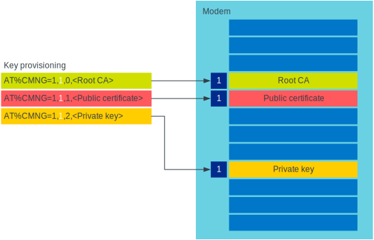

.. _tls_dtls_configuration:

TLS/DTLS configuration
######################

The modem on an nRF9160 device is equipped with a full IPv4/IPv6 stack with TLS/DTLS support.

.. _security_tags:

Security tags
*************

To use the cryptographic functions in the modem, the application must provision the security credentials to the modem.
To be able to provision credentials, the modem must be in offline mode.
The credentials are provisioned through AT commands (see `Credential storage management %CMNG`_).
If you are using the |NCS| to build your application, you can use the :ref:`nrf:modem_key_mgmt` library to manage credentials.
If you prefer a graphical tool, use `LTE Link Monitor`_ instead.
To manage credentials with LTE Link Monitor, your device must be running an |NCS| application.

The following figure shows how security tags are provisioned using AT commands:

   Provisioning credentials with security tag ``1``

As you see, each set of credentials is identified by a security tag (``sec_tag``), which is referenced when a DTLS/TLS socket is created.

The security tag must be attached to a socket using the :c:func:`nrf_setsockopt` function before connecting (through TCP) or transferring data (through UDP).
The following code snippet shows how to set up strict peer verification for a socket and configure the socket to use the security tag ``sec_tag``:

.. code-block:: c

   /* Let 'fd' be a valid UDP or TCP socket descriptor. */

   int err;
   int verify;
   sec_tag_t sec_tag_list[] = { sec_tag };

   enum {
   	   NONE = 0,
	   OPTIONAL = 1,
	   REQUIRED = 2,
   };

   verify = REQUIRED;

   err = nrf_setsockopt(fd, NRF_SOL_TLS, NRF_TLS_PEER_VERIFY, &verify, sizeof(verify));
   if (err) {
	   /* Failed to set up peer verification. */
	   return -1;
   }

   err = nrf_setsockopt(fd, NRF_SOL_TLS, NRF_TLS_SEC_TAG_LIST, sec_tag_list, sizeof(sec_tag_t) * ARRAY_SIZE(sec_tag_list));
   if (err) {
	   /* Failed to set up socket security tag. */
	   return -1;
   }

It is possible to use multiple security tags.
If a list is provided, one of the matching tags is used when handshaking.
For example, you could define the security tag list as follows::

   sec_tag_t sec_tag_list[] = { 4, 5 };

In this case, either security tag 4 or security tag 5 can be used for operations on the socket.

   Using multiple security tags

Supported cipher suites
***********************

See the `nRF9160 modem TLS cipher suites`_ summary page for a full list of TLS/DTLS cipher suites supported by the modem.

Each cipher suite is recognized by an official identification number, which is registered at `IANA`_.
You can narrow down the set of cipher suites that is used for a specific TLS/DTLS connection with :c:func:`nrf_setsockopt`.
For example, see the following code:

.. code-block:: c

   /* TLS_ECDHE_RSA_WITH_AES_256_CBC_SHA */
   nrf_sec_cipher_t cipher_list[] = { 0xC014 };

   err = nrf_setsockopt(fd, NRF_SOL_TLS, NRF_SO_CIPHERSUITE_LIST, cipher_list, sizeof(cipher_list));
   if (err) {
      /* Failed to set up cipher suite list. */
      return -1;
   }

Note that as in the case of other TLS/DTLS socket options, you must do this configuration before connecting to the server.
