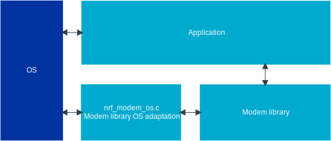
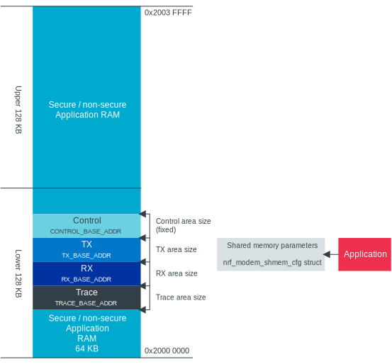

.. _nrf_modem_ug_porting:

Porting the Modem library to your OS
####################################

.. contents::
   :local:
   :depth: 2

The :ref:`nrf_modem` from Nordic Semiconductor is an OS-agnostic C library.
OS-specific parts are moved out of the library.
To use the library with your OS or scheduler, you must first port it by creating a custom :file:`nrf_modem_os.c` file, which serves as an OS abstraction layer.
The library exposes a :file:`nrf_modem_os.h` header file that defines the functions that must be implemented in :file:`nrf_modem_os.c`.
The header file also exposes what functions are provided by the library that the OS integration module must interface with.

The following diagram presents the Modem library OS abstraction layer.
Arrows indicate that the elements can communicate with each other directly.

   Modem library OS abstraction overview

Creating the OS abstraction layer
*********************************

To create an OS abstraction layer for the Modem library, you must implement a number of functions in the :file:`nrf_modem_os.c` file.

nrf_modem_os_init
~~~~~~~~~~~~~~~~~

This function is called by the Modem library when the application has issued :c:func:`nrf_modem_init`.
It is responsible for preparing IRQ for low priority Modem library scheduling and trace scheduling.

.. note::
   When working with an application based on Zephyr, set the IRQs to a low priority (6 or 7) and enable them before exiting the function.

The function must also initialize timers and threads (if there is a context that needs a time-out).
If Nordic Proprietary trace is enabled, the medium for where to forward the trace must also be configured in this function.

*Required actions*:

* Initialize timers/threads.
* Configure low priority libdemom scheduling IRQ (SoftIRQ).
* Configure low priority trace scheduling IRQ (SoftIRQ).
* Configure medium for trace (UART/SPI etc.).

nrf_modem_os_timedwait
~~~~~~~~~~~~~~~~~~~~~~

This function is called by the Modem library when a timed context or sleep is required.
A blind return value of 0 will make all Modem library operations always blocking.

*Required actions* to make the operations non-blocking:

* Start counting the time (this can be based on a Timer or Thread for instance).
* Report back the remaining time of the timer if the specific timer is interrupted.
* If timed out, report NRF_ETIMEDOUT.

nrf_modem_os_errno_set
~~~~~~~~~~~~~~~~~~~~~~

This function translates errno’s from the Modem library to the OS-defined ones.

*Required action*:

* Implement a translation for each errno set by the Modem library.
  If it overlaps with your OS errno, translation is not needed.

nrf_modem_os_application_irq_clear
~~~~~~~~~~~~~~~~~~~~~~~~~~~~~~~~~~

This function is called by the Modem library when the library wants to clear IRQ on the low priority Modem library scheduling IRQ.

*Required action*:

* Clear the low priority Modem library scheduling IRQ using OS primitives or NVIC functions.

nrf_modem_os_application_irq_set
~~~~~~~~~~~~~~~~~~~~~~~~~~~~~~~~

This function is called by the Modem library when the library wants to set a pending IRQ on the low priority Modem library scheduling IRQ.

*Required action*:

* Set a pending IRQ on the low priority Modem library scheduling IRQ using OS primitives or NVIC functions.

nrf_modem_os_trace_irq_clear
~~~~~~~~~~~~~~~~~~~~~~~~~~~~

This function is called by the Modem library when the library wants to clear IRQ on the low priority trace scheduling IRQ.

*Required action*:

* Clear the low priority trace scheduling IRQ using OS primitives or NVIC functions.

nrf_modem_os_trace_irq_set
~~~~~~~~~~~~~~~~~~~~~~~~~~

This function is called by the Modem library when the library wants to set a pending IRQ on the low priority trace scheduling IRQ.

*Required action*:

* Set a pending IRQ on the low priority trace scheduling IRQ using OS primitives or NVIC functions.

nrf_modem_os_trace_put
~~~~~~~~~~~~~~~~~~~~~~

This function puts the trace string to the desired medium, typically UART.
However, the medium used to forward and store the traces is up to the implementation and must be initialized correctly before used.
If you are not interested in traces, they can be ignored and this function can be empty and simply return.

nrf_modem_os_application_irq_handler
~~~~~~~~~~~~~~~~~~~~~~~~~~~~~~~~~~~~

This function is implemented in the Modem library and must be called upon the low priority Modem library IRQ handler, triggered by the :c:func:`nrf_modem_os_application_irq_set` function.

nrf_modem_os_trace_irq_handler
~~~~~~~~~~~~~~~~~~~~~~~~~~~~~~

This function is implemented in the Modem library and must be called upon the low priority trace IRQ handler, triggered by the :c:func:`nrf_modem_os_trace_irq_set` function.

Other scenarios to handle in nrf_modem_os.c
~~~~~~~~~~~~~~~~~~~~~~~~~~~~~~~~~~~~~~~~~~~

#. In case the OS has its own IRQ handler scheme, not directly forwarding the IPC_IRQHandler to the Modem library, this must be routed by the OS.
   The OS must call IPC_IRQHandler() upon all IRQs with IRQ number IPC_IRQn.

#. In :file:`nrf_modem_os.c`, you can configure a desired medium for forwarding trace data upon :c:func:`nrf_modem_os_trace_put` calls .

Memory
******

The Modem library must have a region of absolute positioned RAM.
The region must be configured as non-secure RAM by the secure application.
The starting address of this region must be 0x20010000, and the size of the block is 0xC020 bytes.

The secure domain memory is divided into segments of 8 KB RAM blocks.
Because the size of the Modem library block is 0xC020 bytes, it is not aligned to full 8 KB blocks.
It occupies six blocks and a small part of a seventh block.

The leftover memory in that seventh block (8160 bytes, starting at address 0x2001 c020) is configured as non-secure, but it can be used by the application.

The following RAM overview diagram shows where in the sequential RAM the Modem library must be positioned, and also indicates the important memory position values. The dotted lines represent 8 KB memory blocks. Note that the Modem library occupies more than six full blocks.

   Modem library memory overview

Peripheral requirements
***********************

As the Modem library has been compiled to operate on peripherals in the non-secure domain, the following two peripherals must be configured to be non-secure:

* NRF_IPC
* NRF_POWER

If you are using the hard-float variant of the Modem library, the FPU must be activated in both the secure domain and the non-secure domain, and must be configured to allow the non-secure application to run FPU instructions.

The :file:`nrfx/mdk/system_nrf9160.c` file provides a template on how to configure the FPU in both cases.
The system file also provides several Errata workarounds specific to the chip variant used, which are needed for any secure domain application.

Message sequence diagrams
*************************

The following message sequence diagrams show the interactions between the application, Modem library, and the OS.

1. Sequence of the initialization of the Modem library.
   Configuration of the high and low priority IRQs:

.. figure:: images/msc_init.svg
   :alt: Initialization (main thread)

   Initialization (main thread)

2. Handling an event sent from the Modem library to a lower priority to be able to receive new events:

.. figure:: images/msc_event.svg
   :alt: Event handling, lowering priority

   Event handling, lowering priority

3. Handling traces:

.. figure:: images/msc_trace.svg
   :alt: Trace handling, lowering priority

   Trace handling, lowering priority

4. Handling a time-out or sleep:

.. figure:: images/msc_timers.svg
   :alt: Timers

   Timers

Reference template for the nrf_modem_os.c file
**********************************************

The following code snippet shows a simple implementation of the Modem library OS abstraction layer.
You can use it as a template and customize it for your OS or scheduler.

.. code-block:: c

   #include <nrf_modem_os.h>
   #include <nrf_errno.h>
   #include <nrf_modem_platform.h>
   #include <nrf_modem_limits.h>

   #include <nrf.h>
   #include "errno.h"

   #define TRACE_IRQ          EGU2_IRQn
   #define TRACE_IRQ_PRIORITY 6
   #define TRACE_IRQ_HANDLER  EGU2_IRQHandler

   void read_task_create(void)
   {
       // The read task is achieved using SW interrupt.
       NVIC_SetPriority(NRF_MODEM_APPLICATION_IRQ, NRF_MODEM_APPLICATION_IRQ_PRIORITY);
       NVIC_ClearPendingIRQ(NRF_MODEM_APPLICATION_IRQ);
       NVIC_EnableIRQ(NRF_MODEM_APPLICATION_IRQ);
   }

   void trace_task_create(void) {
       NVIC_SetPriority(TRACE_IRQ, TRACE_IRQ_PRIORITY);
       NVIC_ClearPendingIRQ(TRACE_IRQ);
       NVIC_EnableIRQ(TRACE_IRQ);
   }

   void nrf_modem_os_init(void) {
       read_task_create();
       trace_task_create();
       // Initialize timers / sleeping threads used in the nrf_modem_os_timedwait function.
       // Initialize trace medium used in the nrf_modem_os_trace_put function.
   }

   int32_t nrf_modem_os_timedwait(uint32_t context, int32_t * timeout)
   {
       // Return remaining time by reference in timeout parameter,
       // if not yet timed out.
       // Else return NRF_ETIMEDOUT if timeout has triggered.
       // A blind return value of 0 will make all Modem library operations
       // always block.
       return 0;
   }

   void nrf_modem_os_errno_set(int errno_val) {
       // Translate nrf_errno.h errno to the OS specific value.
   }

   void nrf_modem_os_application_irq_set(void) {
       NVIC_SetPendingIRQ(NRF_MODEM_APPLICATION_IRQ);
   }

   void nrf_modem_os_application_irq_clear(void) {
       NVIC_ClearPendingIRQ(NRF_MODEM_APPLICATION_IRQ);
   }

   void NRF_MODEM_APPLCAITON_IRQ_HANDLER(void) {
       nrf_modem_os_application_irq_handler();
   }

   void nrf_modem_os_trace_irq_set(void) {
       NVIC_SetPendingIRQ(TRACE_IRQ);
   }

   void nrf_modem_os_trace_irq_clear(void) {
       NVIC_ClearPendingIRQ(TRACE_IRQ);
   }

   void TRACE_IRQ_HANDLER(void) {
       nrf_modem_os_trace_irq_handler();
   }

   int32_t nrf_modem_os_trace_put(const uint8_t * const p_buffer, uint32_t buf_len) {
       // Store buffer to chosen medium.
       // Traces can be dropped if not needed.
       return 0;
   }
