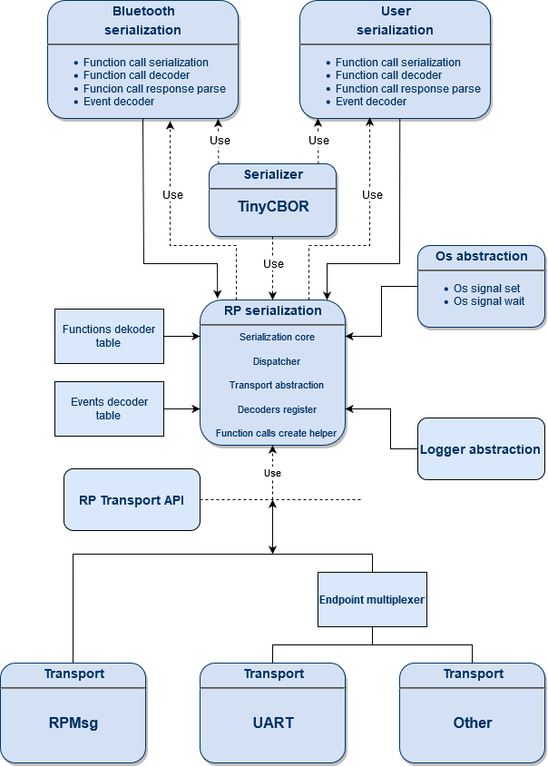
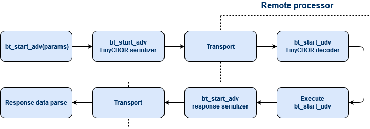
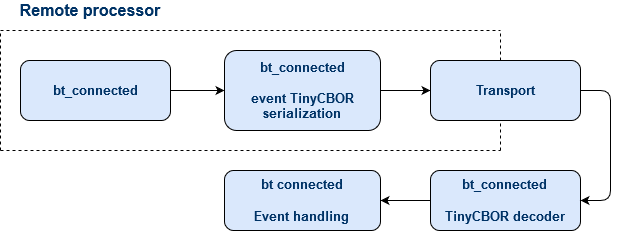

.. architecture:

Architecture
############

The following picture gives an overview of the serialization architecture:

Packet format
=============

The following figure presents the general format of serialized packet:

.. image:: img/data_packet.png
   :alt: Serialization packet format
   :align: center

.. list-table:: Packet data overview
   :header-rows: 1

   * - Packet Type
     - Description
   * - 0x01
     - Command packet, sends to remote processor,
       where it is decoded and the corresponding function is executed
   * - 0x02
     - Event packet, if event is triggered in the remote processor,
       an event packets can be sent to the other processor
   * - 0x03
     - Response packet, after function in the remote processor is called,
       the response is encoded and send to the calling processor

Command (function call)
=======================

The following figure presents the flow of command and response packets in a serialized application:

Events
======

The fallowing figure presents the flow of event packets in a serialized application:

Command and event encoders/decoders
===================================

Module contains an API which helps user to create it own function, event and function response decoders and encoders.
Command and event decoders are placed in special memory section and should be register using macros: :c:macro:`RP_SER_CMD_DECODER` for command and :c:macro:`RP_SER_EVT_DECODER` for event.
One Remote Procedure Serialization Instance can register up to 255 command and event decoders.

Encoders
--------

Encoders are using to encode commands, events and command responses into serialized packets.
Creating an encoder is similar for all packet type. In the first step you have to create and allocate a buffer for serializing data using :c:macro:`rp_ser_buf_alloc`.
Next use one of the following function :cpp:func:`rp_ser_cmd_init`, :cpp:func:`rp_ser_evt_init` or :cpp:func:`rp_ser_rsp_init` to indicate packet type and initialize encoder.
After that you can encode parameters using `TinyCBOR <https://intel.github.io/tinycbor/current/>`_ library.
In last step send packet using one of the sending function.
In case of command which returns data pass response decoder callback to sending function.

Encoding command:

.. code-block:: c

	/* Helper static data */
	struct entropy_rsp {
		u8_t *buffer;
		u16_t length;
		int err_code;
	};

	/* Response decoder */
	static rp_err_t entropy_get_rsp(CborValue *it)
	{
		int err;
		size_t buf_len = rsp_data.length;

		if (!cbor_value_is_integer(it) ||
		    cbor_value_get_int(it, &err)) {
			return RP_ERROR_INTERNAL;
		}

		rsp_data.err_code = err;

		if (cbor_value_advance_fixed(it) != CborNoError) {
			return -RP_ERROR_INTERNAL;
		}

		if (!cbor_value_is_byte_string(it) ||
		    cbor_value_copy_byte_string(it, rsp_data.buffer, &buf_len, it)) {
			return RP_ERROR_INTERNAL;
		}

		if (buf_len != rsp_data.length) {
			return RP_ERROR_INTERNAL;
		}

		return RP_SUCCESS;
	}

	/* Command encoder */
	int entropy_remote_get(u8_t *buffer, u16_t length)
	{
		rp_err_t err;
		struct rp_ser_encoder encoder;
		CborEncoder container;
		size_t packet_size = SERIALIZATION_BUFFER_SIZE;

		if (!buffer || length < 1) {
			return -EINVAL;
		}

		rsp_data.buffer = buffer;
		rsp_data.length = length;

		rp_ser_buf_alloc(entropy_ser, encoder, packet_size);

		err = rp_ser_procedure_initialize(&encoder, &container,
						  ENTROPY_GET_CMD_PARAM_CNT,
						  RP_SER_PACKET_TYPE_CMD,
						  SER_COMMAND_ENTROPY_GET);
		if (err) {
			return -EINVAL;
		}

		if (cbor_encode_int(&container, length) != CborNoError) {
			return -EINVAL;
		}

		err = rp_ser_procedure_end(&encoder);
		if (err) {
			return -EINVAL;
		}

		/* Send command, if response handler is not NULL this function
		 * waits for response from the Remote processor an call response handler.
		 */
		err = rp_ser_cmd_send(&entropy_ser, &encoder, entropy_get_rsp);
		if (err) {
			return -EINVAL;
		}

		return rsp_data.err_code;
	}

Decoders
--------

Decoders is called automatically when receiving command with matching command value.
In case of command decoders, after calling the desired function, they can also encode returned values and send it back to the calling processor in a Response packet.

Decoders registration:

.. code-block:: c

	static rp_err_t entropy_init_handler(CborValue *it)
	{
		int err;

		entropy = device_get_binding(CONFIG_ENTROPY_NAME);
		if (!entropy) {
			rsp_error_code_sent(-EINVAL);

			return RP_ERROR_INTERNAL;
		}

		err = rsp_error_code_sent(0);
		if (err) {
			return RP_ERROR_INTERNAL;
		}

		return RP_SUCCESS;
	}

 	RP_SER_CMD_DECODER(entropy_ser, entropy_init, SER_COMMAND_ENTROPY_INIT,
			   entropy_init_handler);
