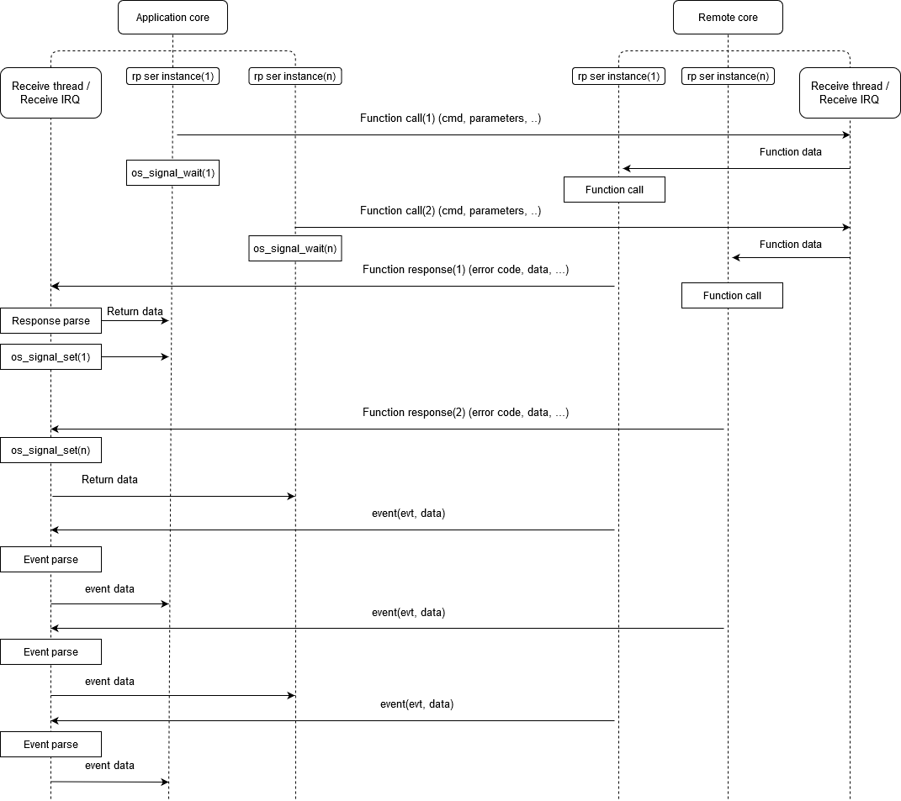

.. _parallel_remote_procedure:

Parallel remote procedure call
##############################

User can create several instances of the Remote Procedure Serialization module.
This can be useful when library is uses in multi-thread operating system like Zephyr then each instance has it own transport endpoint with a receive thread, which processes incoming packets.
This way, multiple serialization users can run in parallel on multiple threads with different execution priorities.
To create a new instance use :c:macro:`RP_SER_DEFINE`.

Multi-instance sequence chart:

