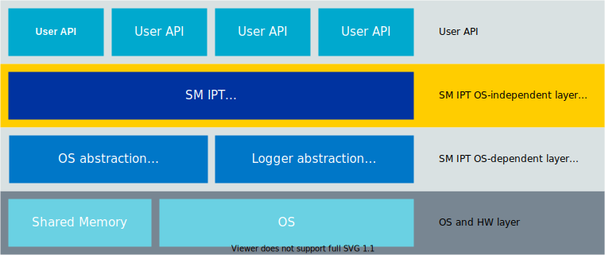

.. _sm_ipt_usage:

Usage and implementation
########################

.. contents::
   :local:
   :depth: 2

The following picture gives an overview of the SM IPT architecture:

   SM IPT architecture layers

Usage
=====

.. note::
   Following examples are purely conceptual and simplified to demonstrate the library functions.
   They should be rewritten to suit particular need and use OS modules like FIFO.

Initialization
--------------

The initialization function initializes the context data and retrieves the shared memory parameters from the :c:func:`sm_ipt_os_init` function.

.. code-block:: c

	struct sm_ipt_ctx sm_ipt_ctx;

	void sm_ipt_receive_handler(const uint8_t *packet, size_t len)
	{
		/* Process data */
		some_data_processing_function();
	}

	int initialize(void)
	{
		return sm_ipt_init(&sm_ipt_ctx, sm_ipt_receive_handler);
	}

The above code uses the :c:func:`sm_ipt_init` function to initialize the :c:struct:`sm_ipt_ctx` SM IPT context data structure and to assign the receive handler.

Data send full-copy
-------------------

The data is prepared beforehand, copied into the allocated buffer and sent to another core.

.. code-block:: c

	int send(const void *data, size_t len)
	{
		uint8_t *buffer;

		sm_ipt_alloc_tx_buf(&sm_ipt_ctx, &buffer, len);

		memcpy(buffer, data, len);

		return sm_ipt_send(&sm_ipt_ctx, buffer, len);
	}

The above code uses the :c:func:`sm_ipt_alloc_tx_buf` function to allocate the transmit buffer in the shared memory.
The data is copied into the said buffer and sent to another core through the :c:func:`sm_ipt_send` function.

Data send no-copy
-----------------

It is possible to operate directly on the transmit buffer to avoid copying from the local buffer.

.. code-block:: c

	int send_nocopy(size_t len)
	{
		uint8_t *buffer;
		size_t i;

		sm_ipt_alloc_tx_buf(&sm_ipt_ctx, &buffer, len);

		/* Use buffer as any other allocated buffer */
		some_data_preparation_function(buffer);

		return sm_ipt_send(&sm_ipt_ctx, buffer, len);
	}

The above code uses the :c:func:`sm_ipt_alloc_tx_buf` function to allocate the transmit buffer in the shared memory.
The buffer is prepared by the :c:func:`some_data_preparation_function` and sent to another core through the :c:func:`sm_ipt_send` function.

Data send abort
---------------

It is possible to free the transmit buffer instead of sending it.

.. code-block:: c

	int send_if(size_t len)
	{
		uint8_t *buffer;
		bool preparation_success;

		sm_ipt_alloc_tx_buf(&sm_ipt_ctx, &buffer, len);

		/* Prepare some data */
		preparation_success = some_data_preparation_function(buffer);

		if (preparation_success) {
			return sm_ipt_send(&sm_ipt_ctx, buffer, len);
		} else {
			sm_ipt_free_tx_buf(&sm_ipt_ctx, buffer);

			return ERROR_ABORT;
		}
	}

The above code uses the :c:func:`sm_ipt_alloc_tx_buf` function to allocate the transmit buffer in the shared memory.
The buffer is sent only if ``preparation_success`` is true.
If ``preparation_success`` is false, the buffer is freed using the :c:func:`sm_ipt_free_tx_buf` function and the send operation is aborted.

Data receive full-copy
----------------------

When data is received, it can be processed using the full-copy mechanism.
The buffer must be copied to the local memory.
The shared memory rx buffer must be freed and data processing takes place on the local copy of the buffer.

.. code-block:: c

	void sm_ipt_receive_handler(const uint8_t *packet, size_t len)
	{
		/* Write content of the buffer to some pipe */
		write_bytes_to_pipe(packet, len);

		/* Free receive buffer */
		sm_ipt_free_rx_buf(&sm_ipt_ctx, packet);

		/* Signal message received */
		data_received = true;
	}

The above code uses the :c:func:`write_bytes_to_pipe` function to copy the shared memory buffer into the local pipe.
The shared memory buffer is freed using the :c:func:`sm_ipt_free_rx_buf` function.
The data is processed locally using a copy of the shared memory buffer.

Data receive no-copy
--------------------

When the data is received, it can be processed using the no-copy mechanism.
The pointer to the shared memory buffer must be saved for later use.
The shared memory rx buffer must be freed and data processing takes place on the shared memory buffer.

.. note::
   This approach increases the risk of out-of-memory errors if the buffer is not freed right after receiving data.

.. code-block:: c

	void sm_ipt_receive_handler(const uint8_t *packet, size_t len)
	{
		/* Put the buffer pointer to some FIFO */
		put_buffer_ptr_to_fifo(packet, len);
	}

	void data_processing_thread(void)
	{
		uint8_t *packet;
		size_t len;

		/* Wait for incoming data */
		get_buffer_ptr_from_fifo(&packet, &len);

		/*Process data */
		some_data_processing_function(packet, len);

		/* Free receive buffer */
		sm_ipt_free_rx_buf(&sm_ipt_ctx, packet);
	}

The above code sets the pointer to the shared memory buffer to the local fifo using the :c:func:`put_buffer_ptr_to_fifo` function.
Next data is processed using the original buffer in the shared memory.
The shared memory buffer is freed using the :c:func:`sm_ipt_free_rx_buf` function.

Lower layers
============

The lower layers of SM IPT are OS-dependent.
They are responsible for memory management, synchronization and logging support.

.. note::
   Details about the implementation of the lower layers are not required when using the SM IPT API.
   However, this knowledge is needed to port to a different operating system.

Operating system abstraction
----------------------------

The operating system abstraction provides the SM IPT functionalities that depend on the operating system.
It manages the shared memory, thread synchronization, and atomic support.

The template header describing the OS abstraction is :file:`template/sm_ipt_os_tmpl.h`.

Logging
-------

SM IPT logs some of its activities.
This allows for tracking, diagnosis, and debugging.
It provides four levels for logging: errors, warnings, information, and debug.

Error logs indicate serious errors, so they should be enabled if possible.
Debug logs should be enabled only for debugging purpose.

The template header describing the logger is :file:`template/sm_ipt_log_tmpl.h`.
