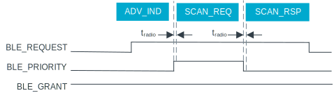

.. _bluetooth_coex_example_diagrams:

Bluetooth External Radio Coexistence examples
#############################################

.. contents::
   :local:
   :depth: 2

3-Wire interface
****************

This section contains example timing diagrams for each supported Bluetooth® Low Energy Link Layer role.
The diagrams describe the coexistence interface's signal activity and the related radio activity.

.. NOTE::
    See :ref:`bluetooth_coex` for the protocol details.

Timing parameters
=================

.. include:: /mpsl/doc/bluetooth_coex_3w_interface_shared_section.rst

Priority and priority escalation
================================

Radio activity requests are associated with a Bluetooth Low Energy Link Layer role, such as advertiser, scanner, central and peripheral.
In the context of the coexistence interface, the application can specify the priority level of a role, either high or low.
Requests inherit their priority level from their associated role.

The application can enable priority escalation for a low priority role by setting a priority escalation threshold for it.
The threshold determines the required number of consecutively rejected requests before the priority is escalated.
Once a request is granted, the priority is reset to low for subsequent requests.

All timing diagrams assume that all supported roles have been configured as low priority.

Connection event
----------------

When in a connected state, a request for radio activity to PTA consists of a single TX-RX pair.
A connection event may consist of a multitude of such pairs.

An example of a connection event where the :ref:`softdevice_controller` is connected as peripheral is shown below.
The depicted connection event consists of two TX-RX pairs.
Within the request and when the BLE_REQUEST signal is active, the BLE_PRIORITY signal toggles t\ :sub:`radio`\  prior to reception.

   Connection event as peripheral

Advertising
-----------

When in advertiser role, a request for radio activity to PTA  consists of the transmission of a single advertising indication.
Any subsequent radio activity triggered by such a packet, for example receiving and responding to a scan request, is part of the same request.
The transmission of a legacy scannable advertising indication in all three primary advertising channels is shown below.

The BLE_REQUEST signal is activated before the transmission of every advertising indication.
After transmitting an advertising indication, the BLE_PRIORITY signal toggles for the potential reception of a scan request.
After the transmission of the third advertising indication, the BLE_PRIORITY signal toggles first for the reception of the scan request and then again for the transmission of the scan response.

   Legacy scannable advertising

The figure below shows the transmission of an extended scannable advertising indication in all three primary advertising channels, along with the transmission of an auxiliary advertising indication on a secondary advertising channel.
Compared to *Legacy scannable advertising* figure above, the BLE_REQUEST signal is deactivated after the transmission of the advertising indication in the primary advertising channels, because a scan request is expected only after the transmission of the auxiliary advertising indication.

   Extended scannable advertising

Scanning
--------

When in scanner/initiator role, a request for radio activity to PTA can be configured to begin in the following cases:

* When the access address of an advertising packet has been received.
  Examples of this configuration are depicted in the figures *Legacy active scanning, request on access address match* and *Extended active scanning, request on access address match*.
  The timing interval t\ :sub:`aa`\  represents the time needed to perform the access address match.
* Before the transmission of a scan or connect request.
  An example of this configuration is depicted in the *Legacy active scanning, request before transmission* figure.

Both configurations presume that the :ref:`softdevice_controller` is using the radio for reception before submitting a request and without informing PTA.
In both cases, any subsequent radio activity triggered by the reception of an advertising indication, such as the transmission of a scan request and the reception of a scan response, is part of the same request.

   Legacy active scanning, request on access address match

   Extended active scanning, request on access address match

   Legacy active scanning, request before transmission

Request denial
--------------

PTA can deny a request at any time after the request has been considered granted.
A denial is indicated by a deactivation of the BLE_GRANT signal.

An example of a connection event where the :ref:`softdevice_controller` is connected as peripheral is shown below.
In the example, the request for the first TX-RX pair is denied during the request.
There is no subsequent request for the following TX-RX pair.
In general, when a request associated with a connected state is denied, the corresponding connection event is aborted.

   Aborted connection event

The transmission of a legacy scannable advertising indication is shown below.
The first request is denied during the transmission of the advertising indication.
There is a subsequent request for the transmission of the advertising indication in the next advertising channel.

   Request denied during legacy advertising
