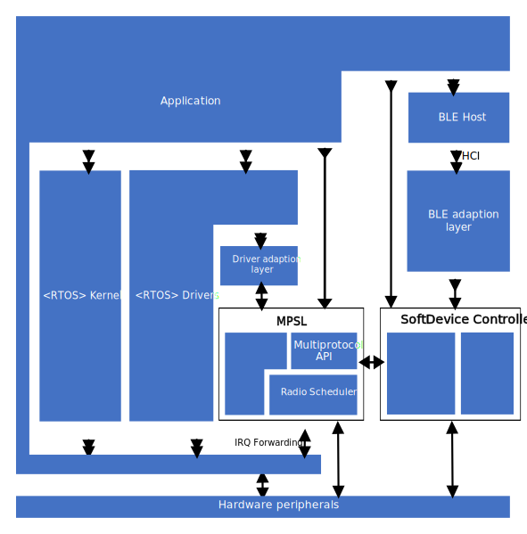

.. _softdevice_controller_readme:

Integration with applications
#############################

The |controller| is an RTOS-agnostic library built for the Nordic Semiconductor nRF52 and nRF53 Series that supports Bluetooth 5.

For the nRF53 Series, the requirements described in this document are only relevant for applications running alongside the |controller| on the network processor.

Applications utilizing the |controller| library are responsible for the following:

* Forwarding RNG interrupts to the |controller| library.
  The application should not add additional processing in the corresponding interrupt handler.
  Otherwise, the behavior is undefined.
* The |controller| relies on the functionality provided by Nordic Semiconductor's :ref:`mpsl`, which has its own set of requirements that the application must follow.
* Ensuring thread-safe operation.
  This can be achieved by either:

   * Calling all |controller| and MPSL APIs from the same execution priority.
   * Ensuring that no API call is interrupted by other API calls, for example by using critical sections.
* Configuring the number of available links:

   * Link configuration must be done before enabling the controller.
   * The application is required to provide a memory buffer the size of which is dependent on the link configuration.

The following peripherals are owned by the |controller| and must not be accessed directly by the application:

* RNG
* ECB
* AAR
* NVMC
* PPI channels 17 - 31, for the nRF52 Series
* DPPI channels 0 - 13, for the nRF53 Series

The APIs provided in :file:`sdc_soc.h` and in MPSL provide the application limited access to some of these peripherals.

Message sequence charts
***********************

The following message sequence chart shows an example on how to initialize the library.
Notice that the :ref:`mpsl` must be initialized before the |controller| is initialized.
The application can choose the features that are enabled and the number of links that are supported.

.. msc::
    hscale = "1.5";
    Host,Controller;
    |||;
    Host rbox Controller [label = "Library initialization"];
    Host->Controller      [label="sdc_init()"];
    Host rbox Controller [label = "Library configuration"];
    Host->Controller      [label="sdc_cfg_set(SDC_CFG_TYPE_MASTER_COUNT)"];
    Host->Controller      [label="sdc_cfg_set(SDC_CFG_TYPE_SLAVE_COUNT)"];
    Host rbox Controller[label = "Feature inclusion"];
    Host->Controller      [label="sdc_support_adv()"];
    Host->Controller      [label="sdc_support_slave()"];
    Host->Controller      [label="sdc_support_2m_phy()"];
    Host rbox Controller [label = "Enable the SoftDevice Controller"];
    Host->Controller      [label="sdc_enable()"];

The following message sequence chart shows a scenario where the application sends a command to the controller.
Later, it retrieves an event and a data packet.
When the host signal is triggered, this indicates that one or more HCI data or event packets are available.
Therefore, the host should try to pull data and events until it fails.

.. msc::
    hscale = "1.5";
    Host,Controller;
    |||;
    Host rbox Controller [label = "Send a command to the controller"];
    Host->Controller      [label="sdc_hci_cmd_put()"];
    Host<-Controller      [label="Host signal is triggered"];
    Host->Controller      [label="sdc_evt_get()"];
    Host<<Controller      [label="Command Complete event"];
    Host rbox Controller [label = "Send data to the controller"];
    Host->Controller      [label="sdc_hci_data_put()"];
    Host<-Controller      [label="Host signal is triggered"];
    Host->Controller      [label="sdc_evt_get()"];
    Host<<Controller      [label="HCI Number Of Completed packets"];
    Host rbox Controller [label = "The controller receives some data and raises an event"];
    Host<-Controller      [label="Host signal is triggered"];
    Host->Controller      [label="sdc_evt_get()"];
    Host<<Controller      [label="Retrieved event"];
    Host->Controller      [label="sdc_data_get()"];
    Host<<Controller      [label="Retrieved data"];

Architecture diagrams
*********************

The image below shows how the |controller| and MPSL integrates in an RTOS-free environment.

.. figure:: pic/Architecture_Without_RTOS.svg

The image below shows how the |controller| and MPSL integrates with an RTOS.

