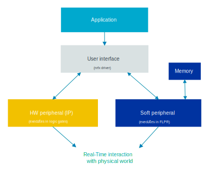

.. _intro_soft_peripherals:

Introduction
############

.. contents::
   :local:
   :depth: 2

Soft peripherals enable the emulation of a digital hardware peripheral (IP) by executing it on the Fast Lightweight Peripheral Processor (FLPR) through an application-controlled user interface.
This functionality allows the soft peripheral to be used in a system where the hardware of a peripheral is not available.
It also allows to include additional instances of a peripheral in case the platform lacks sufficient hardware peripherals.

In most cases, the features and performance of a soft peripheral are equivalent to those of a hardware peripheral.
However, there may be some limitations.
For more information, see the :ref:`sqspi_limitations` and :ref:`semmc_limitations` pages.

The operation of a soft peripheral is abstracted, and its control is facilitated through a user interface managed through the nrfx driver API.
This user interface is a set of functions that the application can call to interact with the peripheral.

The following image shows the software stack of an application:

.. note::

   Note that in both the documentation and source files, soft peripherals are referred to by prefixing the letter *s* before the name of the peripheral.
   For example, ``sQSPI`` or ``sEMMC``.

.. _intro_soft_peripherals_platform_support:

Platform support
****************

The following table shows which soft peripherals and their versions are supported by each platform:

.. list-table:: Soft peripheral device support
   :widths: auto
   :header-rows: 1

   * - Soft peripheral
     - Hardware platform
     - Version
   * - sQSPI
     - - nRF54L Series SoCs
       - nRF54H Series SoCs
     - - nRF54L15 SoC:
          - v0.1.0 with the NCS v3.0.0
          - v1.0.0 with the NCS v3.1.0
          - v1.1.0 with the NCS v3.1.0
          - v1.2.1 with the NCS v3.2.0
       - nRF54LM20 SoC:
          - v1.2.1 with the NCS v3.2.0
       - nRF54H20 SoC:
          - v0.1.0 with the NCS v3.0.0
          - v1.1.0 with the NCS v3.1.0
          - v1.2.1 with the NCS v3.2.0
   * - sEMMC
     - - nRF54L Series SoCs
       - nRF54H Series SoCs
     - - nRF54L15 SoC:
          - v0.1.1 with the NCS v3.2.0
       - nRF54LM20 SoC:
          - v0.1.1 with the NCS v3.2.0
       - nRF54H20 SoC:
          - v0.1.1 with the NCS v3.2.0
