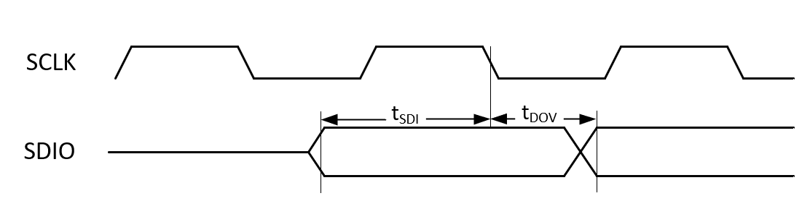
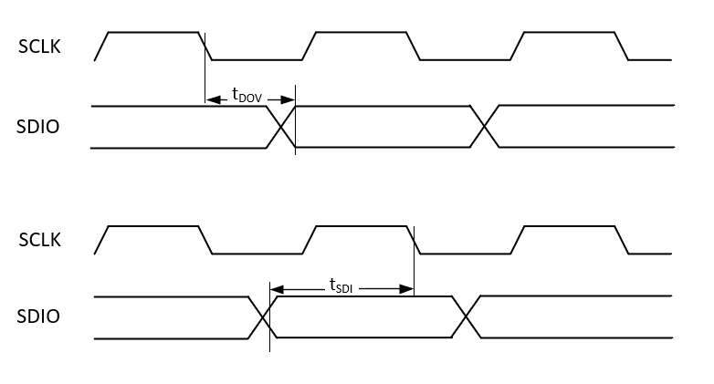

.. _sqspi_timing:

Timing parameters
#################

When working with sQSPI, you should be aware of the associated timing parameters. 

.. contents::
   :local:
   :depth: 2

.. tabs::

   .. tab:: **nRF54L15**

    .. list-table::
      :widths: 20 20 10 10 10 10
      :header-rows: 1

      * - Symbol
        - Description
        - Min
        - Typ
        - Max
        - Units
      * - F\ :sub:`sQSPI,SCLK`
        - SCLK frequency
        -
        -
        - 64
        - MHz
      * - DC\ :sub:`sQSPI,SCLK`
        - SCLK duty cycle
        - 
        - 50
        -
        - %
      * - t\ :sub:`DOV`
        - Data out valid
        -
        -
        - 2.2
        - ns
      * - t\ :sub:`SDI`
        - Data in setup time
        -
        -
        - 11.7
        - ns

   .. tab:: **nRF54H20**

    .. list-table::
      :widths: 20 20 10 10 10 10
      :header-rows: 1

      * - Symbol
        - Description
        - Min
        - Typ
        - Max
        - Units
      * - F\ :sub:`sQSPI,SCLK`
        - SCLK frequency
        -
        -
        - 80
        - MHz
      * - DC\ :sub:`sQSPI,SCLK`
        - SCLK duty cycle
        -
        - 50
        -
        - %
      * - t\ :sub:`DOV`
        - Data out valid
        -
        -
        -
        - ns
      * - t\ :sub:`SDI`
        - Data in setup time
        -
        -
        -
        - ns

The following timing diagrams provide a visual reference to show how the parameters t\ :sub:`DOV` and t\ :sub:`SDI` relate to SCLK.
SDIO represents the data lines.

